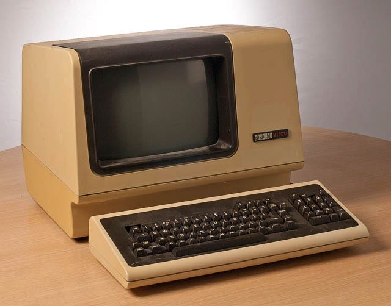
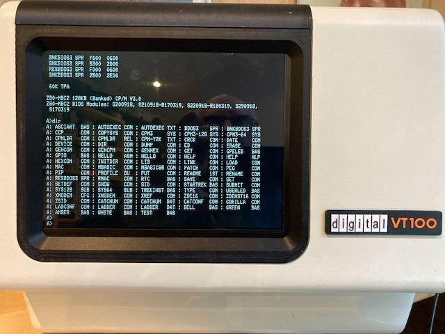
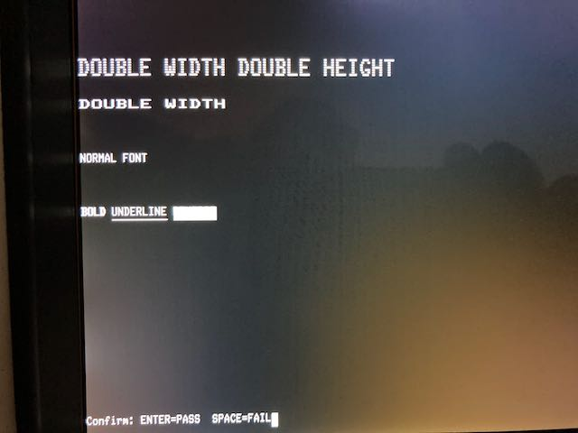
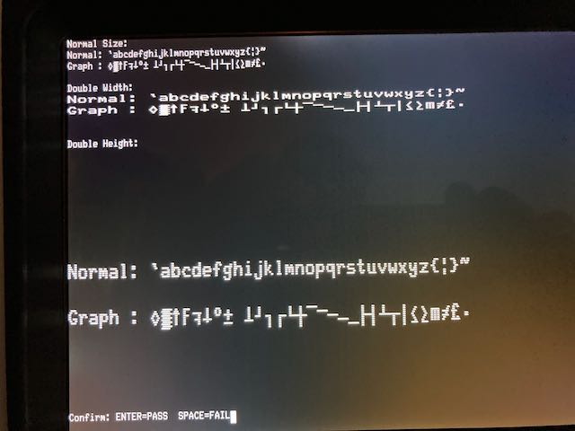

# VT100 Terminal Emulation on Raspberry Pi Zero W with Circle Bare Metal  Framework

## Table of Contents

- [Motivation](#motivation)
- [Regards](#regards)
- [Current Change Status](#current-change-status-2026-09-29)
- [License Statement](#license-statement)
- [Documentation Policy](#documentation-policy)
- [Software Implementation](#software-implementation)
  - [Scope and Goals](#scope-and-goals)
  - [Main Features](#main-features)
  - [Compile Environment Setup](#compile-environment-setup)
    - [Make Targets](#make-targets)
    - [macOS (tested)](#macos-tested)
    - [Important Note about Homebrew formulas](#important-note-about-homebrew-formulas)
  - [Configuration](#configuration)
    - [Configuration File: VT100.txt](#configuration-file-vt100txt)
    - [Available Options](#available-options)
      - [Configuration Summary](#configuration-summary)
      - [VT100 SETUP Screen A Parameter Mapping](#vt100-setup-screen-a-parameter-mapping-current-status)
      - [VT100 SETUP Screen B Parameter Mapping](#vt100-setup-screen-b-parameter-mapping-current-status)
      - [VT100 Extended Setup Dialog (F11)](#vt100-extended-setup-dialog-f11)
    - [DEC Local Mode (F10)](#dec-local-mode-f10)
    - [Example VT100.txt](#example-vt100txt)
  - [Circle Boot Files](#circle-boot-files)
  - [Display Orientation](#display-orientation)
  - [Debug and Logging](#debug-and-logging)
  - [WLAN Telnet and Host Mode](#wlan-telnet-and-host-mode)
    - [Log mode (WLAN diagnostics)](#log-mode-wlan-diagnostics)
    - [Shell-client mode (outbound raw TCP)](#shell-client-mode-outbound-raw-tcp)
    - [Host-side tooling reference](#host-side-tooling-reference)
    - [Auto-start shell-client mode](#auto-start-shell-client-mode)
    - [Strict mode separation](#strict-mode-separation)
  - [Internal VT100 Test Integration](#internal-vt100-test-integration)
  - [Initial Implementation Plan](#initial-implementation-plan)
  - [Templates](#templates)
  - [Overview on Escape Sequence Coverage](#overview-on-escape-sequence-coverage)
  - [VT100 Conformance Assessment](#vt100-conformance-assessment)
  - [Practical vttest Plan](#practical-vttest-plan)
  - [Troubleshooting](#troubleshooting)
    - [Build fails with stdint.h missing](#build-fails-with-fatal-error-stdinth-no-such-file-or-directory)
    - [VT100.txt changes have no effect](#vt100txt-changes-have-no-effect)
    - [Cannot connect to WLAN telnet console](#cannot-connect-to-wlan-telnet-console)
    - [Telnet shows logs but no shell-client traffic](#connected-via-telnet-but-only-logs-appear-no-shell-client-traffic)
    - [Shell-client uses UART instead of the remote host](#shell-client-mode-enabled-but-vt100-still-follows-uart-host)
    - [screen does not connect directly to TCP](#screen-does-not-connect-directly-to-tcp)
    - [Auto-enter host mode on every connect](#auto-enter-host-mode-on-every-connect)

## Motivation
My main motivation was that I wanted a terminal emulation for my VT100 replica (https://www.instructables.com/23-Scale-VT100-Terminal-Reproduction/) which I printed and assembled. I wanted something that could start within seconds, so a bare metal implementation on a Pi Zero seems to be the way to go. I looked into the PiGFX implementation by Filippo Bergamasco (https://github.com/fbergama/pigfx) and PiVT VT220 Emulator by Hans Hübner (https://github.com/hanshuebner/pivt). PiGFX for my taste was to much focused on reproducing vintage games on Z80 hardware or similar whereas PiVt was focused on VT220 with minimal configurability. Also the support for VT100 features like font stretching, double width fonts and double width double height fonts was missing in both implementations. 
So I decided to start my own VT100 Emulator journay and here is the result.

Below you see the original VT100 terminal (the color has turned to yellow over the years) and my 60% replica in a color that matches the original "oyster white" and some font examples:

<table>
  <tr>
    <td></td>
    <td></td>
  </tr>
  <tr>
    <td></td>
    <td></td>
  </tr>
</table>

The follwing link gives a very good view of the original VT100 from 1079:
- [Pictures of a VT100 from 1979](https://www.artstation.com/artwork/d05JgW)

The current VT100 terminal firmware turns a Raspberry Pi Zero W into a self-contained ANSI/VT100-compatible console. It boots straight into the terminal without Linux, using the Circle bare-metal framework for deterministic hardware access. The design targets headless benches and retro workstations that need a physical keyboard and display front-end for serial hosts.

This project also includes a PCB design to support enhanced features such as a buzzer, an RS-232 adapter, a Mini-DIN-6 adapter for MBC2-Z80, and power distribution for the Pi Zero, MBC2, and display, plus a backplate to mount the board inside a 60% VT100 replica designed by megardi.

My aim was to replicate the behaivior of a true VT100 as close as possible (vttest will show the final result ;-) ) and be able to mimic a VT52, VT220 and my favorite the VT320 in amber, also I did not replicate the small deviations of the VT220 or VT320 font sets. I got the original font definitions for a VT100 font from the ROM data used by Lars Brinkhoff to simulate a VT100 terminal in software on a Pi.

If you want a nearly 100% VT100 terminal simulation, please go for the VT100 simulation from Lars Brinkhoff (https://github.com/larsbrinkhoff/terminal-simulator). He simulates the complete VT100 hardware with original ROMs on a Raspberry Pi. The Pi executes the ROM by an 8080 emulator and simulates other components like video display with character generator ROM, settings NVRAM, Intel 8251 USART, and a keyboard matrix scanner. 

## Regards

Many thanks to Rene Stange (https://github.com/rsta2) for the creation of the Circle bare metal framework for Raspberry Pis. Without his work this project would not have been possible.

I take my hat off to the engineers a DEC which did a terrific job implementing the VT100 based on the technologies available at that time. They squeezed all functionality I implemented on a Pi with 1 GHz frequency and 512MB into a 8080A with 2Mhz, 8kB of ROM (including the original VT100 7x10 font) and 3kB of RAM. Granted, a lot of the features I had to implement in software were done with analog circuits, but I really feel embarressed by their skills.

## Current Change Status (2026-09-29)

- Hardware: the V2.3 design adds a GPIO7-controlled 5 V supply for a DIN6-connected SBC, BSS138 RX/TX level shifters, a 40 V / 2 A bridge rectifier, revised resistor pads, regulator notes, and a top-mount USB-A connector. The V2.3 board has not yet been manufactured or hardware-tested; the GPIO7 power test remains pending.
- Firmware: persistent `sbc_power` (default `0`) is available in the modern F11 setup and is applied at startup and when setup settings are saved with Enter. Setup-dialog behavior has been verified.

## License Statement 
Copyright (C) 2026 Ralf Zühlsdorff

This software and hardware design are released under the MIT License. You may use, copy, modify, merge, publish, distribute, sublicense, and/or sell copies of it, subject to including the copyright notice and permission notice in all copies or substantial portions.

## Documentation Policy

This project keeps documentation in a strict 4-document model:

- This `README.md` document provides the functional overview of the implemented software and user-facing operation guidance.
- [Architecture Overview](VT100/docs/VT100_Architecture.md) is the single technical architecture + implementation reference for developers.
- [Configuration Guide](VT100/docs/Configuration_Guide.md) contains all configuration guidance, split into user/operator and admin/developer parts.
- [Hardware Design](VT100/docs/Hardware.md) contains the KiCad design of the PCB and the OpenSCAD files for printing the backplate.

Generated API documentation is also published via GitHub Pages:

- [Doxygen HTML Documentation](https://rzuehlsd.github.io/PiZero_VT100/)

When implementation changes affect behavior, update these documents in lockstep and avoid introducing additional overlapping technical documents.

# Software Implementation

The application initialises USB keyboard input, the framebuffer, GPIO, UART, and WLAN within Circle and runs a cooperative task loop that keeps the terminal responsive even under heavy serial traffic. Classic aesthetics are preserved by rendering converted VT100 ROM fonts at 1024x768, while modern conveniences such as remote logging remain available.

The current renderer keeps terminal text, attributes, and DEC line-size state primarily in a shadow buffer and then projects that model onto the framebuffer through a dedicated projector task. During active smooth scrolling the projector stays on the incremental region-update path and defers any required catch-up full refresh until the animation completes. This makes state restore, scrolling, insert/delete operations, and external `vttest`-style screen rewrites behave against one consistent terminal model instead of depending on already-drawn pixels.

## Scope and Goals

- Provide a responsive VT100/ANSI terminal experience with integrated keyboard, framebuffer, and UART handling.
- Preserve classic look-and-feel through ROM-derived fonts, colour themes, and optional CRT-style scan lines.
- Offer configurable serial, display, audio, and logging behaviour via both on-device UI and SD-card files.
- Deliver flexible diagnostics through screen, file, and WLAN logging with remote telnet mirroring.
- Keep deployment simple: copy firmware, configuration files, and optional fonts onto an SD card and power the Pi.


## Main Features

- [x] USB keyboard input with Circle keymap support for multiple languages
- [x] Configurable line endings (LF, CRLF, CR)
- [x] Separate `VT100.txt` configuration file on the SD boot partition
- [x] Circle boot configuration via `cmdline.txt` and `config.txt`
- [x] Serial UART interface to host via RS232 and Mini-DIN-6 connector
- [x] Support for TCP/IP host connections
- [x] Framebuffer renderer supporting multiple VT fonts and colour themes
  - [x] DEC VT100 ROM 8x20 with scan-line simulation
  - [x] VT100 10x20 CRT-style font derived from DEC VT100 ROM Font
  - [x] VT100 10x20 solid font derived from DEC VT100 ROM Font
  - [x] DEC VT100 Special Graphics Character Set support (via `ESC ( 0` and `ESC ( B`)
  - [x] Dynamic Double-Width / Double-Height line attributes with DEC top/bottom-half semantics (`ESC #3/#4/#5/#6`)
  - [x] Visible SGR blink text rendering synchronized to the existing cursor blink cadence
  - [x] White, amber, and green on black simulate DEC monochrome terminals (VT100, VT220, VT320)
- [x] VT100 and ANSI escape sequence parser and renderer based on the VT-parse project
- [x] Configurable optional VT52 escape sequence support
- [x] 800 Hz buzzer with configurable volume for bell and key click feedback
- [x] Logging infrastructure with screen, file, and WLAN sinks
  - [x] Real-time debug output with formatted log messages
  - [x] WLAN debug output via telnet session
  - [x] WLAN split between incoming telnet log mode and outbound shell-client mode (current implementation)
  - [x] Shell-client mode can auto-connect from `host_id` or prompt locally for `IPv4[:port]`
  - [x] WLAN logging and shell-client mode successfully validated with local loopback and raw TCP helper tooling
- [x] GPIO16-controlled TX/RX swap to simulate Null Modem cables with straight DB9 cables
- [x] Configuration of system via VT100 Setup Screens A and B for supported parameters
- [x] Separate on-screen setup dialog covering the 24 persisted `VT100.txt` keys implemented there, including `smooth_scroll`, `smooth_scroll_ms`, `host_id`, and SBC power via `sbc_power` / GPIO7 (F11)


The following table gives an overview of implementation highlights:

| Area | Highlights |
| --- | --- |
| **Core Terminal** | ANSI/VT100 parser, ROM-derived fonts, shadow-buffer-first framebuffer renderer with DEC line-size control and visible blink attributes |
| **Input** | USB keyboard with F12 legacy setup, F11 modern setup, F10 local mode toggle, optional key click |
| **Serial** | Configurable UART baud rates, software flow control (XON/XOFF), GPIO16 TX/RX swap |
| **Display & Audio** | Runtime font switching, colour themes, buzzer tones, projector-owned smooth-scroll tuning, periodic status tasks |
| **Configuration** | SD-based `VT100.txt`, Circle `cmdline.txt`/`config.txt`, manual SD-card editing |
| **Logging** | Bitmask-controlled outputs (screen, file, WLAN), telnet console, timestamped files |
| **Networking** | WLAN bring-up with WPA supplicant, telnet banner showing `ip:2323` |
| **Deployment** | Makefile-driven build, SD card copy workflow, optional bootloader assets |

WLAN remote operation test status: WLAN logging mode and outbound shell-client mode have been successfully tested with local loopback and the helper workflows documented in `VT100/tools/README.md`.

And here are the results of the internal tests which could be switched on in VT100.txt config file:


## Compile Environment Setup

### Make Targets

The following table lists the implemented Make targets available from `VT100/Makefile` (including targets inherited via `../Rules.mk`) and their purpose.

| Target | Purpose |
| --- | --- |
| `all` | Default target; builds firmware image and copies it to `VT100/bin/kernel.img`. |
| `kernel.img` | Creates/refreshes local `kernel.img` symlink to `VT100/bin/kernel.img`. |
| `clean` | Removes generated build artifacts (`build/`, intermediate objects, map/list/elf/img outputs). |
| `docs` | Generates Doxygen documentation from `VT100/Doxyfile` into `VT100/docs/doxygen/`. |
| `docs_clean` | Removes generated Doxygen output directories/files under `VT100/docs/doxygen/`. |

This project needs a **complete bare-metal Arm GNU toolchain** (compiler + target C library headers like `stdint.h`).


### macOS (tested)

Install required host tools and the full Arm toolchain:

```bash
brew install make
brew install --cask gcc-arm-embedded
```

Configure Circle to use the full toolchain path explicitly:

```bash
cd /Users/ralf/Projekte/VT100_Circle
./configure -f -p /Applications/ArmGNUToolchain/15.2.rel1/arm-none-eabi/bin/arm-none-eabi-
```

Verify the compiler and header availability:

```bash
/Applications/ArmGNUToolchain/15.2.rel1/arm-none-eabi/bin/arm-none-eabi-gcc --version
printf '#include <stdint.h>\nint main(void){return 0;}\n' | \
    /Applications/ArmGNUToolchain/15.2.rel1/arm-none-eabi/bin/arm-none-eabi-gcc -x c - -c -o /tmp/vt100_stdint_test.o
```

Build steps:

```bash
cd /Users/ralf/Projekte/VT100_Circle
./makeall
cd VT100
make -j4
```

### Important Note about Homebrew formulas

The Homebrew formula `arm-none-eabi-gcc` may be built without target headers (`--without-headers`), which can cause errors like `fatal error: stdint.h: No such file or directory`. The `gcc-arm-embedded` cask provides the complete toolchain required by this project.

## Configuration

The VT100 terminal reads configuration from `VT100.txt` on the SD boot partition and supplements it with Circle boot parameters in `cmdline.txt` and firmware settings in `config.txt`/`config64.txt`.

### Configuration File: VT100.txt

Create or edit `VT100.txt` on the boot partition. The firmware loads it on startup, and settings can be changed either by manual edits or via the on-screen setup dialogs (F11/F12). See [VT100/bin/VT100.txt](VT100/bin/VT100.txt) for the shipping template.

### Available Options

#### Configuration Summary

| Key | Allowed values | Default | Notes |
| --- | --------------- | ------- | ----- |
| `baud_rate` | 50–921600 | 115200 | Host serial speed |
| `serial_bits` | 7/8 | 8 | UART data bits (SET-UP B Bits/Char) |
| `serial_parity` | 0–2 | 0 | UART parity (0=none, 1=even, 2=odd) |
| `background_color` | 0–3 | 0 | Palette: 0=black, 1=white, 2=amber, 3=green |
| `buzzer_volume` | 0–80 | 50 | Sets 800 Hz buzzer duty cycle (0 disables tone; values above 80 are clamped) |
| `cursor_blinking` | 0/1 | 0 | 1 enables blink animation |
| `cursor_type` | 0/1 | 0 | Cursor style (0=underline, 1=block) |
| `key_auto_repeat` | 0/1 | 1 | Enables or disables keyboard auto-repeat |
| `vt_test` | 0/1 | 0 | Run built-in VT test sequences |
| `vt52_mode` | 0/1 | 0 | Terminal mode: 0=ANSI (VT100), 1=VT52 |
| `font_selection` | 1–3 | 2 | Choose between 8x20, 10x20 CRT, 10x20 solid |
| `flow_control` | 0/1 | 0 | Software XON/XOFF UART flow control |
| `key_click` | 0/1 | 1 | Enables or disables key click feedback |
| `line_ending` | 0–2 | 0 | Enter key behaviour: 0=LF, 1=CRLF, 2=CR |
| `host_id` | String (IPv4[:port]) | empty | Default shell-client target used when `wlan_host_autostart=2` |
| `log_filename` | String (≤63 chars) | vt100.log | Used when file logging is active |
| `log_output` | 0–7 | 0 | 0=off, 1=screen, 2=file, 3=WLAN, 4=screen+file, 5=screen+WLAN, 6=file+WLAN, 7=all |
| `smooth_scroll` | 0/1 | 1 | Enables non-blocking smooth single-line scroll animation |
| `smooth_scroll_ms` | 10–500 | 170 | Sets the target duration per scrolled text line |
| `wrap_around` | 0/1 | 1 | Controls right-margin wrap (`1`) vs overwrite-at-last-column (`0`) |
| `repeat_delay_ms` | 250–1000 | 250 | Delay before auto-repeat starts |
| `repeat_rate_cps` | 2–20 | 10 | Characters per second once repeating |
| `margin_bell` | 0/1 | 0 | Rings bell 8 columns before right margin when enabled |
| `switch_txrx` | 0/1 | 0 | Drives GPIO16 high to swap wiring |
| `wlan_host_autostart` | 0–2 | 0 | Current implementation policy: 0=off, 1=log mode, 2=outbound shell-client mode |
| `text_color` | 0–3 | 1 | Foreground palette: 0=black, 1=white, 2=amber, 3=green |

On-screen configuration is available through the VT100 SET-UP dialogs A and B, opened with `F12`, and through an extended configuration dialog opened with `F11`. The extended dialog covers 23 persisted `VT100.txt` keys plus the runtime-applied visual settings; `flow_control`, `wrap_around`, and `margin_bell` remain on the legacy VT100-style `F12` path.

#### VT100 SETUP Screen A Parameter Mapping (current status)

The table below maps the current SET-UP A screen controls to firmware behavior.

| SET-UP A item | Corresponding config/runtime state | Implementation status |
| --- | --- | --- |
| Horizontal tab stops (per column) | Runtime tab-stop map via `CTConfig::SetTabStop()` / `CTConfig::IsTabStop()` | Implemented |
| Cursor movement in ruler (`Left`, `Right`, `Home`, `End`) | Tab edit cursor in SET-UP A ruler line | Implemented |
| Set/clear tab at current column (`T` / space) | Updates tab stop at current column | Implemented |
| Tab-stop persistence in `VT100.txt` | Not mapped to persisted file keys yet | Not implemented |


#### VT100 SETUP Screen B Parameter Mapping (current status)

The table below maps original VT100 SET-UP B terms to the current firmware configuration model.

| Tab group | Parameter name (VT100 docs) | Corresponding config param | Implementation status |
| --- | --- | --- | --- |
| 1 | Scroll | `smooth_scroll` (leftmost bit in group 1, mask `0x8`) | Implemented |
| 1 | Auto Repeat | `key_auto_repeat` (+ `repeat_delay_ms`, `repeat_rate_cps`) | Implemented |
| 1 | Screen | runtime-only (`screen_inverted`, not persisted) | Implemented |
| 1 | Cursor | `cursor_type` | Implemented |
| 2 | Bell | `margin_bell` (group 2 leftmost bit, mask `0x8`) | Implemented |
| 2 | Keyclick | `key_click` | Implemented |
| 2 | ANSI/VT52 | `vt52_mode` | Implemented |
| 2 | Auto XON/XOFF | `flow_control` (group 2 rightmost shown bit, mask `0x1`) | Implemented |
| 3 | US/UK # | N/A | Not implemented |
| 3 | Wraparound | `wrap_around` (group 3 second bit from left, mask `0x4`) | Implemented |
| 3 | New Line | `line_ending` | Implemented |
| 3 | Interlace | N/A | Not implemented |
| 4 | Parity Sense | `serial_parity` (1=even, 2=odd when parity enabled) | Implemented |
| 4 | Parity | `serial_parity` (0=none, 1/2=enabled) | Implemented |
| 4 | Bits/Char | `serial_bits` (7/8) | Implemented |
| 4 | Power | N/A | Not implemented |
| — | T SPEED (Transmit Speed) | `baud_rate` | Implemented |
| — | R SPEED (Receive Speed) | Follows `baud_rate` (TX speed) | Always follows transmit speed |

#### VT100 Extended Setup Dialog (F11)

Press `F11` to open the extended setup dialog. The dialog uses DEC special graphics box drawing, keeps the active terminal color/font theme, uses a centered normal-width title, and shows a three-column `parameter` / `value` / `description` view for the 23 persisted `VT100.txt` keys exposed there, including `smooth_scroll`, `smooth_scroll_ms`, and `host_id`. The remaining persisted keys `flow_control`, `wrap_around`, and `margin_bell` stay mapped to the VT100-compatible `F12` setup flow. Before the overlay takes over the screen, the renderer aborts any active smooth-scroll animation and forces a stable projector refresh so the dialog always starts from a complete framebuffer state. Press `F12` for the legacy VT100 setup screens; their title renders as a true two-line DEC double-height header with `TO EXIT PRESS "SET-UP"` directly below it, matching the original VT100 layout more closely.

Controls:

- `Up` / `Down`: select parameter row
- `Left` / `Right`: change selected value
- `Return`: save to runtime + `VT100.txt` and exit
- `Esc`: cancel changes and exit

Runtime apply on `Return` (current firmware):

- Immediate runtime apply: renderer visuals (`text_color`, `background_color`, `font_selection`, cursor type/blink, VT52 mode, `smooth_scroll`, `smooth_scroll_ms`) and HAL settings (`buzzer_volume`, `switch_txrx`).
- Persisted and used by runtime logic without dedicated re-init: `line_ending`, `key_click`, `key_auto_repeat`.
- Persisted (applied on subsystem init / reconnect / reboot): serial framing (`baud_rate`, `serial_bits`, `serial_parity`), keyboard repeat timing (`repeat_delay_ms`, `repeat_rate_cps`), logging targets (`log_output`, `log_filename`), and WLAN host settings (`wlan_host_autostart`, `host_id`).
- Persisted legacy-setup-only keys: `flow_control`, `wrap_around`, and `margin_bell` are edited through `F12`, not through the modern `F11` table.
- While a setup dialog is visible, cooked and raw keyboard events are routed into `CTSetup`, queued in a small FIFO, and then processed in the setup task context so redraws remain stable even when the shell-client connection is active.

### DEC Local Mode (F10)

The DEC feature to toggle the terminal between local (not connected to host) and line (connected to host) mode can be triggered by pressing `F10`.

- `ON`: keyboard input is looped directly to the renderer (local echo), and host output is not sent over UART/TCP.
- `OFF`: keyboard input follows the normal host path again.

The terminal prints a short status line (`VT100 local mode ON/OFF`) when toggled.

### Example VT100.txt

Most of the configurations can be defined in the file VT100.txt on the root volume of the boot SD. The following sections give a summary:

```ini
# VT100 Terminal Configuration File
# Place this file as VT100.txt on the SD card boot partition.
# Values below match firmware defaults.

# --- Serial communication ---
# Host serial speed in bits per second
baud_rate=115200

# UART framing:
# serial_bits: 7 or 8
# serial_parity: 0=None, 1=Even, 2=Odd
serial_bits=8
serial_parity=0

# --- Keyboard / line handling ---
# line_ending: 0=LF, 1=CRLF, 2=CR
line_ending=0

# key_auto_repeat: 0=off, 1=on
key_auto_repeat=1

# smooth_scroll: 0=off, 1=on
smooth_scroll=1

# smooth_scroll_ms: 10..500 milliseconds per text line
smooth_scroll_ms=170

# wrap_around: 0=overwrite at last column, 1=wrap to next line
wrap_around=1

# flow_control: 0=off, 1=software XON/XOFF
flow_control=0

# Delay before repeat starts (milliseconds: 250..1000)
repeat_delay_ms=250

# Repeat rate (characters per second: 2..20)
repeat_rate_cps=10

# key_click: 0=off, 1=on
key_click=1

# --- Terminal mode / display ---
# vt52_mode: 0=ANSI (VT100), 1=VT52
vt52_mode=0

# cursor_type: 0=underline, 1=block
cursor_type=0

# cursor_blinking: 0=steady, 1=blinking
cursor_blinking=0

# vt_test: 0=off, 1=on
vt_test=0

# font_selection: 1=8x20, 2=10x20 CRT, 3=10x20 solid
font_selection=2

# Palette indices: 0=black, 1=white, 2=amber, 3=green
text_color=1
background_color=0

# --- Sound / wiring ---
# buzzer_volume: 0..80 (percent duty cycle)
buzzer_volume=50

# margin_bell: 0=off, 1=ring 8 columns before right margin
margin_bell=0

# switch_txrx: 0=normal wiring, 1=swapped via GPIO16
switch_txrx=0

# --- Logging ---
# log_output:
# 0=off
# 1=screen
# 2=file
# 3=wlan
# 4=screen+file
# 5=screen+wlan
# 6=file+wlan
# 7=screen+file+wlan
log_output=0


# wlan_host_autostart: 0=off, 1=remote log mode, 2=outbound shell-client mode
wlan_host_autostart=0

# host_id: default shell-client target when wlan_host_autostart=2
# Format: IPv4[:port] (e.g. 192.168.2.10 or 192.168.2.10:2323). Leave empty to prompt.
host_id=

# Log file name (max 63 chars)
log_filename=vt100.log
```

## Circle Boot Files

- `cmdline.txt` — Parsed by Circle during boot. Keep options on one line, e.g. `logdev=tty1 loglevel=4 width=1024 height=768 keymap=DE`.
- `config.txt` / `config64.txt` — Raspberry Pi firmware settings. The template applies `dtoverlay=miniuart-bt`, `enable_uart=1`, and `display_hdmi_rotate=2` for the upside-down LCD in the replica enclosure.

Both templates live in `VT100/bin` alongside the firmware image and WLAN support files.

## Display Orientation

In the 60% VT100 replica, depending on the specific model used, the 1024x768 LCD can hide part of the first line and the left-most characters behind the bezel when mounted in the natural orientation. Mounting the panel upside down resolves the mechanical clearance issue. Rotate the output by 180° by adding the following firmware setting to the active `config.txt`/`config64.txt`:

```ini
display_hdmi_rotate=2
```

This rotates the HDMI output 180° at the firmware level so the framebuffer keeps its normal coordinate system without extra rendering adjustments.

## Debug and Logging

The terminal ships with a logging subsystem that mirrors messages to any combination of screen, SD card file, and WLAN telnet session:

- Smart fallback selects a working sink during early boot and transitions seamlessly once the framebuffer is ready.
- Messages use familiar prefixes (`[NOTE]`, `[WARN]`, `[ERROR]`) with file/line metadata to simplify troubleshooting.
- Screen logging integrates with the terminal view without breaking VT100 escape handling.
- WLAN logging announces readiness with `WLAN ready: telnet <ip>:2323`; connect via telnet to monitor remotely.
- Outbound shell-client integration over raw TCP is available for host-side helpers and interactive shells.

Refer to `VT100/docs/VT100_Architecture.md` for technical architecture and implementation details, and `VT100/docs/Configuration_Guide.md` for runtime controls and configuration.

For the architecture and lifecycle model of WLAN log mode and host mode separation, see `VT100/docs/VT100_Architecture.md` (section 8.3).
For host-side helper scripts and character-mode client recommendations, see `VT100/tools/README.md`.

## WLAN Telnet and Host Mode

This firmware currently supports two WLAN behaviors that share the same raw TCP port (`2323`) but serve different roles:

1. **Log mode** (command prompt mode) for remote diagnostics and control.
2. **Shell-client mode** for an outbound VT100-initiated raw TCP session to a configured host.

### Log mode (WLAN diagnostics)

Use this mode when you want to inspect runtime logs and run maintenance commands without replacing the UART host path.

```bash
telnet <ip-or-mDNS-name> 2323
```

Typical session:

```text
help
status
echo hello from remote debug
exit
```

What you get in this mode (current):

- Mirrored log output (`[NOTE]`, `[WARN]`, `[ERROR]` etc.) over telnet.
- Device/network status via `status`.
- Session close via `exit`.
- The telnet endpoint stays in command/log mode when `wlan_host_autostart=1`.

For host-side caveats about `telnet` line mode versus character mode, see `VT100/tools/README.md`.

### Shell-client mode (outbound raw TCP)

When `wlan_host_autostart=2`, the VT100 enters shell-client mode. In this mode the VT100 itself initiates an outbound raw TCP connection to a target host and then bridges VT100 keyboard TX to that remote peer while rendering TCP RX directly on the screen.

Current behavior in the implementation:

- The target is taken from `host_id` when configured.
- If `host_id` is empty, the VT100 prompts locally on screen for `IPv4[:port]` and defaults to port `2323`.
- Host names are not accepted in this path; the parser expects numeric IPv4 plus optional port.
- UART host rendering is suspended while the outbound shell-client session is active to avoid mixed sources.

Typical configuration:

```ini
wlan_host_autostart=2
host_id=192.168.2.10:2323
```

Session behavior:

- Keyboard TX from the VT100 app is sent to the connected remote TCP peer.
- TCP RX from that peer is rendered directly to the VT100 screen.
- The raw shell-client session remains active until the remote side disconnects or WLAN mode is disabled.
- On the next activation, mode selection is applied again from `wlan_host_autostart`, reusing `host_id` if present.

Recommended host-side helpers are documented in `VT100/tools/README.md`.

Typical host-side workflows:

```bash
cd VT100/tools
./start_raw_shell_server.sh --kill-existing
```

For a local character-mode client against that raw listener:

```bash
cd VT100/tools
./raw_shell_client.sh 127.0.0.1 2323
```

Alternative character-mode clients from the tools README:

```bash
nc <host-ip> <port>
```

or

```bash
socat -,raw,echo=0 TCP:<host-ip>:<port>
```

If `telnet` must be used for troubleshooting, switch it to character mode (`Ctrl-]`, then `mode character`).

Recommended workflow:

1. Set `wlan_host_autostart=2`.
2. Set `host_id=<server-ip>[:port]` or leave it empty to use the on-screen prompt.
3. Start a raw TCP server on the host side, for example with `./start_raw_shell_server.sh` from `VT100/tools`.
4. Interact with the VT100 and verify outbound connect, RX/TX bridging, and shell behavior.

### Host-side tooling reference

The raw shell helper scripts live here:

- `VT100/tools/README.md`
- [VT100/tools/start_raw_shell_server.sh](/Volumes/SSD1000/2_Workbench/2_HW_Projekte/4_Realisierte_Projekte/21_PiZero_VT100/VT100/tools/start_raw_shell_server.sh)
- [VT100/tools/raw_shell_client.sh](/Volumes/SSD1000/2_Workbench/2_HW_Projekte/4_Realisierte_Projekte/21_PiZero_VT100/VT100/tools/raw_shell_client.sh)

Use that README as the source of truth for host-side helper usage and client-mode caveats.

### Auto-start shell-client mode

Set the config parameter in `VT100.txt`:

```ini
wlan_host_autostart=2
host_id=192.168.2.10:2323
```

With this enabled, the VT100 starts the outbound shell-client path instead of waiting in telnet log mode. Set `wlan_host_autostart=1` to keep the incoming `telnet <ip> 2323` endpoint in command/log mode.

### Strict mode separation

WLAN modes are handled as strictly separated session types:

- **Log mode**: remote logs, status, diagnostics, and orderly `exit` only.
- **Shell-client mode**: raw outbound TCP bridge only; no log/status chatter over the host payload channel.

Architecture-relevant mode-separation details are maintained in `VT100/docs/VT100_Architecture.md` (section 8.3).

## Internal VT100 Test Integration

The internal test functions are integrated into the kernel to verify most implemented escape sequences without a host connection while still sharing the same keyboard/UART path:

- A periodic task (`CPeriodicTask`) calls `RunVTTestTick()` every 50 ms to advance timed steps, scroll tests, and summary rendering.
- `onKeyPressed()` forwards keyboard input to `HandleVTTestKey()` first; when a test is active it consumes Enter/Space for PASS/FAIL, otherwise it forwards input to the host UART unchanged.
- The VTTest lifecycle is controlled via `vt_test=0|1` in `VT100.txt` and `CTConfig::SetVTTestEnabled()` when the test ends.

These changes keep VTTest self-contained while preserving normal keyboard/UART behavior when the test is not active.

## Initial Implementation Plan

- [x] Boot application initialising framebuffer with startup banner
- [x] USB support for keyboard and serial port with loopback testing
- [x] Raw keyboard input forwarded to screen
- [x] ANSI escape sequence parsing and rendering
- [x] Configuration system with `VT100.txt` persistence
- [x] SD card filesystem access for configuration storage
- [x] Logging infrastructure with smart fallback across screen/file/WLAN
- [x] Real-time debug output with formatted log messages
- [x] Screen logging that preserves VT100 behaviour
- [x] Serial UART communication implementation
- [x] Bell, TX/RX switching, and other VT100 niceties
- [x] ROM-derived VT100 font support and converter pipeline
- [x] Multi-language keyboard layouts (US, DE, others supported by Circle)
- [x] 800 Hz buzzer with configurable key click
- [x] Configurable auto-repeat for printable, deletion, and cursor keys
- [x] On-screen configuration dialog for all parameters
- [x] WLAN debug log messages via telnet
- [x] Renderer support for bold and underline attributes
- [x] ESC sequence handling for double-width/double-height modes (dynamic scaling)
- [x] Font converter updates for double-width/double-height glyphs (simplified logic)
- [x] Internal VTTest coverage inside kernel (activate with flag `vt_test=1`)
- [x] Comprehensive Test Suite (Core, DEC, Graphics)
- [x] Dynamic Summary showing all tests based on screen geometry
- [x] Implementation of VT100 Setup A and B
- [x] Implementation of additional on-screen configuration dialog for all file-based parameters
- [x] Implementation of TCP host connection
- [x] Implement smooth scrolling (single-line, non-blocking animation)
- [x] Test coverage on Unix hosts with tool `vttest`

## Templates

The `templates/` directory provides starter files for new modules and deployment config:

- `task_header.tmpl` and `task_implementation.tmpl` are generic task scaffolds.
- Replace all `TaskName`/`CTaskName` placeholders with your concrete module name before adding files under `include/` and `src/`.
- Keep the generated task pattern consistent with existing modules: singleton `Get()`, `Initialize()`, and cooperative `Run()` loop.
- `VT100.txt`, `cmdline.txt`, and `config.txt` are baseline SD-card templates and should stay aligned with the current `CTConfig` key set and defaults.

## Overview on Escape Sequence Coverage

The table below lists the escape and control sequences handled by this firmware, mapped to the DEC/ANSI families they belong to. “Implementation status” reflects what this codebase currently does when the sequence is received, and “Test” references the VTTest step when available.

| Sequence | Description | VT52 | VT100 | VT220 | VT320 | ANSI | Implementation status | Test |
| --- | --- | --- | --- | --- | --- | --- | --- | --- |
| ^H (BS) | Cursor left | ✓ | ✓ | ✓ | ✓ | ✓ | Implemented | [PASS] |
| ^I (HT) | Tab forward | ✓ | ✓ | ✓ | ✓ | ✓ | Implemented (tab stops) | [PASS] |
| ^J (LF) | New line | ✓ | ✓ | ✓ | ✓ | ✓ | Implemented | [PASS] |
| ^M (CR) | Carriage return | ✓ | ✓ | ✓ | ✓ | ✓ | Implemented | [PASS] |
| ESC M | Reverse index | — | ✓ | ✓ | ✓ | ✓ | Implemented | [PASS] |
| ESC 7 | Save cursor (DECSC) | — | ✓ | ✓ | ✓ | — | Implemented | [PASS] |
| ESC 8 | Restore cursor (DECRC) | — | ✓ | ✓ | ✓ | — | Implemented | [PASS] |
| ESC H | VT52 home (cursor to 1,1) | ✓ | — | — | — | — | Implemented | [PASS] |
| ESC A | VT52 cursor up | ✓ | — | — | — | — | Implemented | [PASS] |
| ESC B | VT52 cursor down | ✓ | — | — | — | — | Implemented | [PASS] |
| ESC C | VT52 cursor right | ✓ | — | — | — | — | Implemented | [PASS] |
| ESC D | VT52 cursor left | ✓ | — | — | — | — | Implemented | [PASS] |
| ESC E | VT52 next line | ✓ | — | — | — | — | Implemented | [PASS] |
| ESC J | VT52 clear to end of screen | ✓ | — | — | — | — | Implemented | [PASS] |
| ESC K | VT52 clear to end of line | ✓ | — | — | — | — | Implemented | [PASS] |
| ESC Y r c | VT52 direct cursor address | ✓ | — | — | — | — | Implemented | [PASS] |
| ESC H | Set tab stop (HTS) | — | ✓ | ✓ | ✓ | ✓ | Implemented (ANSI mode) | [PASS] |
| ESC < | Enter ANSI Mode | ✓ | — | — | — | — | Implemented | [PASS] |
| ESC #3 | Double-height line (top) | — | ✓ | ✓ | ✓ | — | Implemented (renders upper half of DEC double-height glyph) | [PASS] |
| ESC #4 | Double-height line (bottom) | — | ✓ | ✓ | ✓ | — | Implemented (renders lower half of DEC double-height glyph) | [PASS] |
| ESC #5 | Normal line size | — | ✓ | ✓ | ✓ | — | Implemented | [PASS] |
| ESC #6 | Double-width line | — | ✓ | ✓ | ✓ | — | Implemented | [PASS] |
| ESC #8 | Screen test | — | ✓ | ✓ | ✓ | — | Implemented (DECALN fill) | [PASS] |
| ESC [ A | Cursor up (CUU) | — | ✓ | ✓ | ✓ | ✓ | Implemented | [PASS] |
| ESC [ B | Cursor down (CUD) | — | ✓ | ✓ | ✓ | ✓ | Implemented | [PASS] |
| ESC [ C | Cursor right (CUF) | — | ✓ | ✓ | ✓ | ✓ | Implemented | [PASS] |
| ESC [ D | Cursor left (CUB) | — | ✓ | ✓ | ✓ | ✓ | Implemented | [PASS] |
| ESC [ H | Cursor home (CUP) | — | ✓ | ✓ | ✓ | ✓ | Implemented | [PASS] |
| ESC [ r;c H | Cursor position (CUP) | — | ✓ | ✓ | ✓ | ✓ | Implemented | [PASS] |
| ESC [ J | Erase to end of screen (ED) | — | ✓ | ✓ | ✓ | ✓ | Implemented | [PASS] |
| ESC [ 2 J | Clear entire screen (ED=2) | — | ✓ | ✓ | ✓ | ✓ | Implemented | [PASS] |
| ESC [ K | Erase to end of line (EL) | — | ✓ | ✓ | ✓ | ✓ | Implemented | [PASS] |
| ESC [ n X | Erase characters (ECH) | — | ✓ | ✓ | ✓ | ✓ | Implemented | [PASS] |
| ESC [ n L | Insert lines (IL) | — | ✓ | ✓ | ✓ | ✓ | Implemented | [PASS] |
| ESC [ n M | Delete lines (DL) | — | ✓ | ✓ | ✓ | ✓ | Implemented | [PASS] |
| ESC [ n P | Delete characters (DCH) | — | ✓ | ✓ | ✓ | ✓ | Implemented | [PASS] |
| ESC [ 4 h / 4 l | Insert mode (IRM) | — | ✓ | ✓ | ✓ | ✓ | Implemented | [PASS] |
| ESC [ n m | Select graphic rendition (SGR) | — | ✓ | ✓ | ✓ | ✓ | Partial (monochrome subset: 0,1,2,4,5,7,22,24,27) | [PASS] |
| ESC [ 0 m | SGR reset (attributes/colors) | — | ✓ | ✓ | ✓ | ✓ | Implemented | [PASS] |
| ESC [ 1 m | SGR bold/intense | — | ✓ | ✓ | ✓ | ✓ | Implemented | [PASS] |
| ESC [ 2 m | SGR dim/half-bright | — | ✓ | ✓ | ✓ | ✓ | Implemented | [PASS] |
| ESC [ 22 m | SGR normal intensity | — | ✓ | ✓ | ✓ | ✓ | Implemented | [PASS] |
| ESC [ 4 m | SGR underline | — | ✓ | ✓ | ✓ | ✓ | Implemented | [PASS] |
| ESC [ 24 m | SGR underline off | — | ✓ | ✓ | ✓ | ✓ | Implemented | [PASS] |
| ESC [ 5 m | SGR blink | — | ✓ | ✓ | ✓ | ✓ | Implemented (visible text blink synchronized to the cursor blink cadence) | [PASS] |
| ESC [ 7 m | SGR reverse video | — | ✓ | ✓ | ✓ | ✓ | Implemented | [PASS] |
| ESC [ 27 m | SGR reverse off | — | ✓ | ✓ | ✓ | ✓ | Implemented | [PASS] |
| ESC [ 30-37 / 90-97 m | Set foreground color | — | ✓ | ✓ | ✓ | ✓ | Not implemented as ANSI color rendering | [PASS] |
| ESC [ 40-47 / 100-107 m | Set background color | — | ✓ | ✓ | ✓ | ✓ | Not implemented as ANSI color rendering | [PASS] |
| ESC [ ? 2 l | Enter VT52 Mode | — | ✓ | ✓ | ✓ | — | Implemented | [PASS] |
| ESC [ ? 25 h / l | Cursor visible (DECTCEM) | — | ✓ | ✓ | ✓ | — | Implemented | [PASS] |
| ESC [ r1; r2 r | Scroll region (DECSTBM) | — | ✓ | ✓ | ✓ | — | Implemented | [PASS] |
| ESC [ g | Clear tab stop (TBC) | — | ✓ | ✓ | ✓ | ✓ | Implemented | [PASS] |
| ESC [ 3 g | Clear all tab stops (TBC) | — | ✓ | ✓ | ✓ | ✓ | Implemented | [PASS] |
| ESC [ Z | Back-tab (CBT) | — | ✓ | ✓ | ✓ | ✓ | Implemented | [PASS] |
| ESC d + / d * | Auto page mode on/off | — | — | — | — | — | Implemented (local) | [PASS] |

**VT52 note:** The parser supports a strict VT52 mode enabled via `ESC [ ? 2 l` and disabled via `ESC <`. `ESC H` acts as VT52 Home only in VT52 mode; in ANSI mode, it acts as HTS (Set Tab Stop).

**Color note:** The firmware emulates monochrome VT100/VT220/VT320 terminals. ANSI color SGR codes are intentionally ignored; choose text/background colors in `VT100.txt` instead.

**Source-of-truth note:** The status entries above are derived from the current renderer implementation in `VT100/src/TRenderer.cpp`. When this table and older prose disagree, the code should be treated as authoritative.

## VT100 Conformance Assessment

The primary compatibility goal for this project is VT52 plus the core VT100 behavior set. Later DEC/xterm-style extensions and features that conflict with the reduced 60% hardware are secondary.

The table below groups the current implementation into three buckets for practical conformance work:

- `100%`: implemented in the current parser/renderer without an explicit known limitation in code.
- `Partial`: implemented only as a subset, approximation, or with visible behavioral limits.
- `Not met`: explicitly ignored or absent in the current implementation.

This is still not a claim of full original-hardware fidelity. If you need near-complete hardware-level VT100 behavior, see the recommendation near the top of this README.

Hardware and product-scope constraints that intentionally shape this assessment:

- `DECCOLM` (`80/132 columns`) is outside the target because the current framebuffer/display geometry is fixed by the hardware design. With the default `VT100Font10x20` on the current 1024-pixel-wide framebuffer, the renderer can show only about 102 text columns, not 132. As a result, the second `vttest` cursor-movement screen, which is intentionally built against a 132-column layout, cannot be displayed correctly on this hardware.
- `DECKPAM` and `DECKPNM` are outside the target because the reduced 60% keyboard has no numeric keypad block.
- `DECCKM` is lower priority for the same reason: it only changes which escape sequences dedicated cursor keys send to host applications.

For local `vttest` runs this also means: the second movement-test screen is only avoided if `vttest` itself is started with a reduced `max_cols` value such as `24x80.80`. If that run still draws a 132-column second pass, the geometry override was not actually applied to the running `vttest` process.

Current `vttest` status for the first VT100 section: with the fixes in this repository, the 80-column tests in the first section now pass, including cursor movements, autowrap, and cursor-control characters inside escape sequences. The remaining visible mismatch in that section is limited to the 132-column `DECCOLM` passes, which stay outside the hardware-supported display geometry.

`DECCKM` explained briefly: in normal cursor-key mode the arrow keys typically send `ESC [ A/B/C/D`; in application cursor-key mode they send `ESC O A/B/C/D`. Some full-screen host applications care about that distinction.

| VT100 property | Fulfillment | Notes |
| --- | --- | --- |
| VT52 compatibility mode | 100% | VT52 control subset and mode switching are implemented and are a primary target. |
| Basic cursor control (`BS`, `CR`, `LF`, `CUU`, `CUD`, `CUF`, `CUB`, `CUP`, `HVP`) | 100% | Implemented in the parser and dedicated cursor helpers. |
| Screen and line erase (`ED`, `EL`) | 100% | Variants `0`, `1`, and `2` are implemented. |
| Character edits (`ICH`, `DCH`, `ECH`) | 100% | Insert, delete, and erase-char behavior is present. |
| Line edits (`IL`, `DL`) | 100% | Works within the active scroll region. |
| Scroll semantics (`IND`, `NEL`, `RI`) | 100% | Forward and reverse scrolling behavior is implemented. |
| Scroll region (`DECSTBM`) | 100% | Includes VT100-style clamping for oversized parameters. |
| Wraparound mode (`DECAWM`) | 100% | Uses VT100-style wrap-pending behavior at the last column. |
| Origin mode (`DECOM`) | 100% | Cursor addressing is relative to the active scroll region. |
| Save and restore cursor (`DECSC`, `DECRC`, `CSI s/u`) | 100% | Position, modes, and key attributes are restored. |
| Tab handling (`HT`, `HTS`, `TBC`, `CBT`) | 100% | Forward tab, set/clear stop, clear-all, and back-tab are implemented. |
| Device reports (`DA`, `DSR 5`, `DSR 6`) | 100% | The terminal replies to identity and status queries. |
| Character sets (`G0/G1`, DEC Special Graphics) | Partial | Standard DEC ASCII plus DEC Special Graphics switching are implemented, and `vttest` Character Sets test 3 passes on that basis, but there is no DEC Alternate Character Set implementation. |
| Alignment test (`DECALN`, `ESC #8`) | 100% | Implemented as full-screen alignment fill. |
| Insert mode (`IRM`, `CSI 4 h/l`) | 100% | Printable characters are inserted when the mode is enabled. |
| SGR core subset (`0`, `1`, `2`, `4`, `5`, `7`, `22`, `24`, `27`) | Partial | Supported set is limited to monochrome attributes plus explicit off-codes. |
| SGR blink text behavior | 100% | Blink-marked text now visibly hides and reappears on the shared cursor/text blink cadence. |
| DEC line attributes (`ESC #3`, `#4`, `#5`, `#6`) | 100% | Double-width and double-height line attributes now use distinct VT100 top/bottom-half semantics, with `#5` restoring normal line size. |
| Application keypad mode (`DECKPAM`, `DECKPNM`) | Not targeted | Explicitly ignored by the parser and intentionally outside scope because the 60% keyboard has no numeric keypad. |
| Cursor key application mode (`DECCKM`) | Not targeted | Explicitly ignored by the parser; accepted limitation for the reduced keyboard/input model. |
| 80/132-column switching (`DECCOLM`) | Not targeted | Outside scope because the current hardware uses a fixed display geometry. |
| ANSI color rendering via SGR | Not met | Terminal remains monochrome; colors are selected via configuration instead. |
| Full original VT100 hardware fidelity | Not met | The project emulates behavior, not the complete DEC hardware stack. |

## Practical vttest Plan

The most reliable way to turn the matrix above into an evidence-based report is to run `vttest` from a Unix host against the firmware and record each section as `pass`, `partial`, or `fail`.

Recommended workflow:

1. Start with the built-in `VTTest` for a quick on-device sanity check of cursoring, scrolling, wraparound, DEC graphics, and line attributes.
2. Connect from a Unix host in raw character mode. Avoid telnet line mode, otherwise control-key and cursor tests become misleading.
3. Run `vttest` and keep a simple report sheet with these columns: `section`, `expected result`, `observed result`, `status`, `notes`.
4. Treat the code-based matrix in this README as the expected baseline before you begin. Any mismatch between `vttest` and the matrix is worth investigating.

Suggested `vttest` interpretation for the current implementation:

| vttest area | Expected result | Why |
| --- | --- | --- |
| Cursor movement and direct cursor addressing | Pass | Core cursor commands are implemented and already covered by the internal test suite. |
| Screen clearing and line clearing | Pass | `ED` and `EL` variants are implemented. |
| Insert/delete chars and lines | Pass | `ICH`, `DCH`, `ECH`, `IL`, and `DL` are implemented in the renderer. |
| Scrolling, reverse index, and scroll regions | Pass | `IND`, `NEL`, `RI`, and `DECSTBM` are implemented. |
| Wraparound tests | Pass | The renderer carries a dedicated wrap-pending state for VT100-style behavior. |
| Origin mode tests | Pass | `DECOM` is implemented and influences cursor addressing. |
| Device attributes and status reports | Pass | Primary `DA`, `DSR 5`, and `DSR 6` replies are implemented. |
| Tab stop handling | Pass | Forward tab, set/clear tab stop, clear all, and back-tab are present. |
| VT52 mode tests | Pass | VT52 subset and ANSI escape back to normal mode are implemented. |
| DEC special graphics | Partial | Standard DEC ASCII plus DEC Special Graphics switching work, which is sufficient for `vttest` Character Sets test 3, but there is no DEC Alternate Character Set implementation. |
| SGR attribute tests | Partial | Bold, dim, underline, reverse, reset, and visible blink now work for the monochrome SGR subset, but ANSI color rendering remains intentionally unsupported. |
| Blink attribute tests | Pass | `SGR 5` is rendered visibly by reusing the existing cursor blink cadence. |
| DEC double-width / double-height line tests | Pass | Internal VTTest sequences use true `ESC #3`/`#4` top-and-bottom pairs plus `#5` reset semantics. |
| Keypad application mode tests | Not targeted | `DECKPAM` and `DECKPNM` are outside the current product scope because the keyboard has no numeric keypad. |
| Cursor key application mode tests | Not targeted | `DECCKM` is outside the current product scope and currently ignored. |
| 80/132-column switching tests | Not targeted | `DECCOLM` is outside scope because the display geometry is fixed by the hardware. |
| ANSI color tests | Fail | The firmware is monochrome and does not apply color SGR codes. |

When you run `vttest`, capture the exact menu section names alongside the outcomes. That gives you a reproducible conformance ledger and a concrete backlog for the remaining `partial` and `fail` items.

## Troubleshooting

This section collects practical checks and fixes for the most common setup and runtime issues.

### Build fails with `fatal error: stdint.h: No such file or directory`

Cause: incomplete ARM toolchain (compiler installed without target C library headers).

Fix: follow section 5.1 (tool installation and configure command) and section 5.2 (Homebrew formula note) to install the complete toolchain and reconfigure Circle.

Optional cleanup to avoid accidental compiler mismatch:

```bash
brew uninstall arm-none-eabi-gcc arm-none-eabi-binutils arm-none-eabi-gdb
```

### `VT100.txt` changes have no effect

Checklist:

- File name must be exactly `VT100.txt`.
- File must be on the SD boot partition expected by firmware (`SD:/VT100.txt`).
- Keep `key=value` format; unknown keys are ignored.
- Reboot after changing config.

Quick verification key for this feature set:

```ini
wlan_host_autostart=1
```

### Cannot connect to WLAN telnet console

Checklist:

- Confirm WLAN logging is enabled in config (`log_output` includes WLAN: 3, 5, 6, or 7).
- Wait until the network is up and mDNS/IP is announced in logs.
- Connect to port `2323`:

```bash
telnet <ip-or-hostname.local> 2323
```

### Connected via telnet, but only logs appear (no shell-client traffic)

You are in command/log mode. Follow section 9.2 to switch to shell-client mode and to return to command/log mode.

### Shell-client mode enabled but VT100 still follows UART host

Expected behavior in current firmware: UART rendering is paused while shell-client mode is active. If behavior looks mixed:

- Ensure only one active telnet client is connected.
- Repeat the section 9.2 mode-switch sequence once.
- Confirm section 9.4 configuration for `wlan_host_autostart` is set as intended (`0`, `1`, or `2`).

### `screen` does not connect directly to TCP

`screen` requires a tty/pty, not a raw TCP socket. Follow the complete `socat` + `screen` bridge procedure in section 9.3.

### Auto-enter host mode on every connect

Set `wlan_host_autostart` as described in section 9.4.
