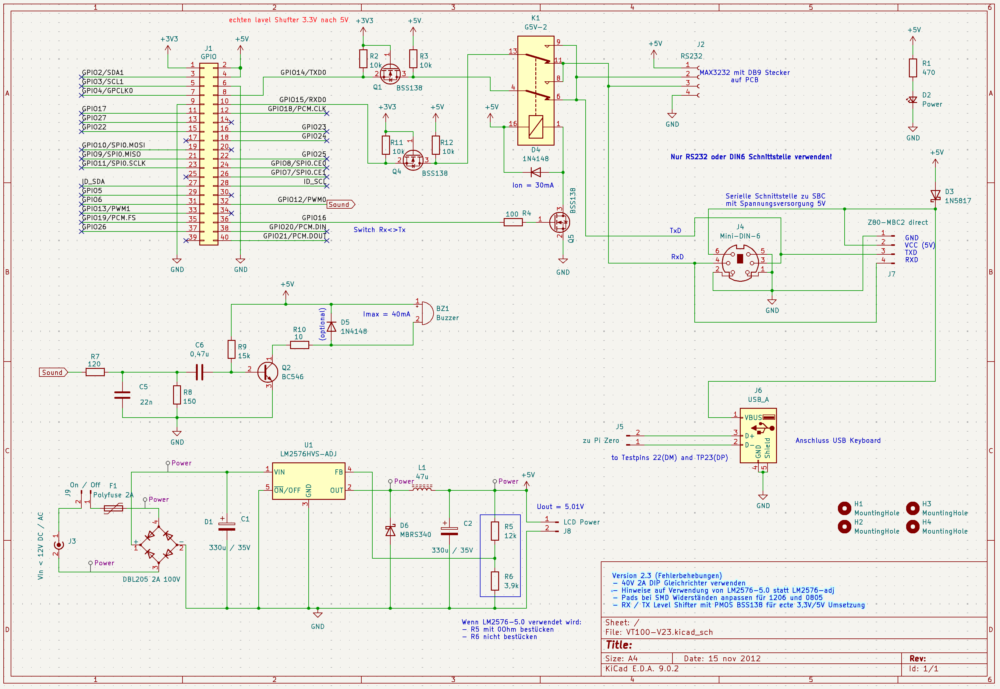
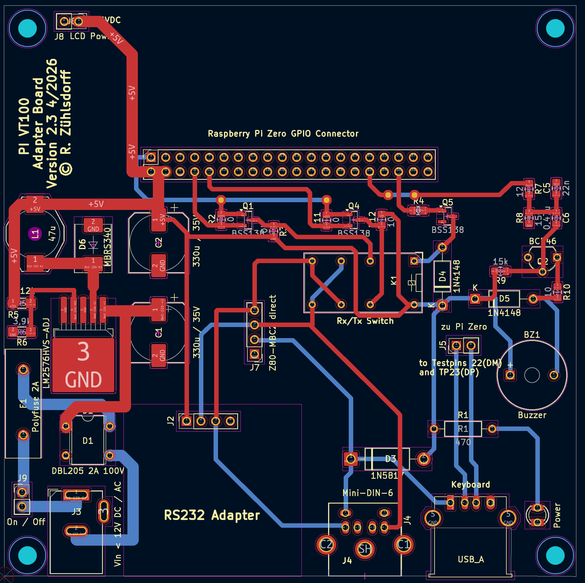
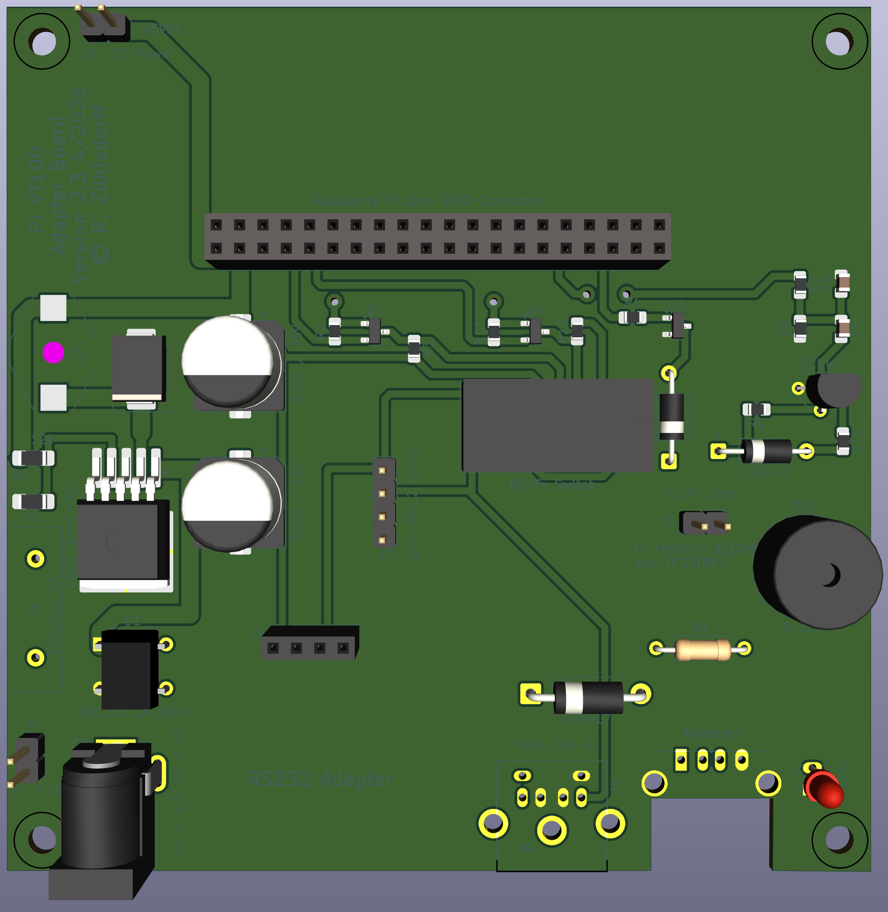
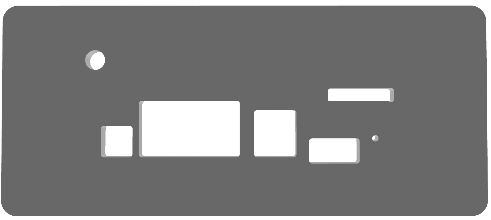
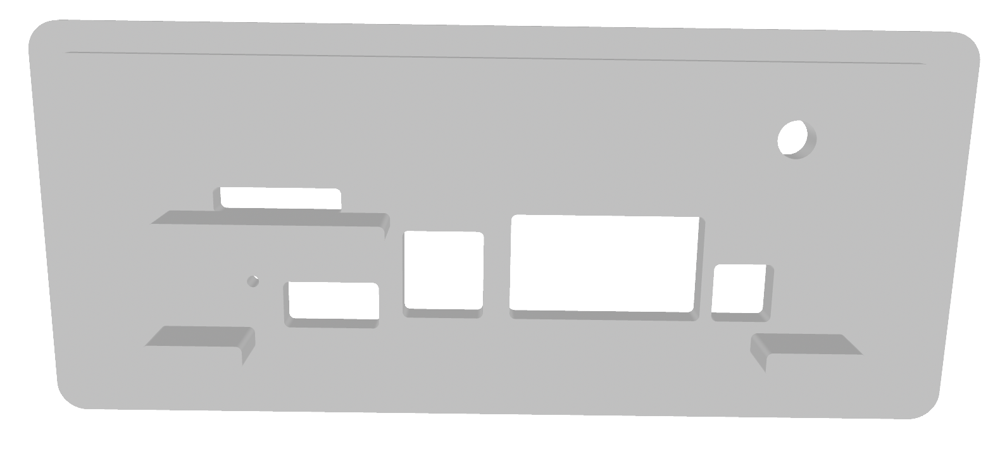

# Carrier Board for Pi Zero VT100 Terminal

This project designs and builds a carrier board for the Raspberry Pi Zero that, together with the Pi Zero software, enables a bare-metal implementation of a VT100 terminal.
The current documented software/runtime behavior is described in `README.md`, `docs/Configuration_Guide.md`, and `docs/VT100_Architecture.md`.

The carrier board can be mounted directly inside the terminal enclosure of a 60% VT100 replica designed by megardi (https://www.instructables.com/23-Scale-VT100-Terminal-Reproduction/) and provides the following features:
- 5 VDC / 2 A power supply (input 7–9 V DC or AC / 2 A wall adapter)
- RS‑232 interface to the host computer with MAX3232
- Alternative host interface via Mini‑DIN‑6 connector and 4‑pin header (used by me for my MBC2-Z80)
- USB‑A connector for a wired USB keyboard
- Switch (relay) to swap RxD and TxD for RS-232
- 800 Hz buzzer (optional)

The Pi Zero GPIO pins are **not** 5V tolerant. In version 2.2, in a null-modem cable scenario, the host's 5V TxD signal could reach the unprotected Pi TxD GPIO pin until the relay is switched. This is a **brief but real risk** if a null-modem cable is connected without immediate relay switching.

The documented V2.3 adapter-board design addresses this risk by adding true 3.3V/5V level shifters for RxD and TxD using PMOS BSS138. This design is documented in the schematic/layout below, but as noted in the revision-status section it has not yet been manufactured and hardware-validated.

The MAX3232 board with Vcc connected to the 5V output of the Pi Zero handles the RS-232 compatibility for the host interface. In the documented V2.3 design, the serial signals pass through the BSS138 level shifters so that the Pi sees 3.3V-side logic levels.

#
**Current documented hardware status of version 2.3 (2026-05-06):**

  
  

**3D preview of the documented V2.3 board:**

  

The images above show the documented V2.3 schematic and layout, which use an LM2576 switching regulator to provide the 5 V / 2 A rail for the display controller and the MBC2 through the DIN6 connector. If an LM2576-adj is used, both SMD resistors can be populated to select a voltage slightly above 5 V (for example 5.1 - 5.2 V). This was observed as a possible mitigation for occasional display flicker when the screen is inverted (white background). If an LM2576-5V is used, one resistor position is bridged (0R).

The USB keyboard input is wired to two test points below the USB connector of the Pi. Click and bell sounds are generated via an 800 Hz PWM signal from GPIO and a small buzzer. Switching of the Tx/Rx lines of the RS-232 connector is done by a relay controlled from a GPIO pin.

The V2.3 schematic/layout reflect the currently documented next board baseline.

An adapter for the MBC2‑Z80 to connect the Z80 via the Mini‑DIN‑8 connector is described in the sub‑project “Z80‑SBC_Adapter”.

Board revisions:
- [x] Barrel jack for 9 V DC / AC input
- [x] Replace regulator LM2576 switching regulator (LM2576-50 / LM2576-adj)
- [x] LED indicator On/Off
- [x] Contacts for power switch
- [x] RxD <> TxD swap via relay, switchable by Pi GPIO pin
- [x] USB‑A socket for keyboard connection
- [x] Mini‑DIN‑6 socket for direct MBC2 connection with power
- [x] RS‑3232 DB9 connector
- [x] BSS138 level shifter for TxD and RxD
- [x] Internal header for direct MBC2 connection inside the terminal enclosure
- [x] PCB cut‑out for the USB plug (very short pins)
- [x] Buzzer / speaker circuit added
    - [x] Pads for piezo buzzer, 12.5 mm diameter, 5 mm pitch
- [x] Schematic revised for external fabrication

## Backplate for VT100 case to mount board 

A new backplate has been developed in OpenScad to be able to mount the pcb and insert it in the opening slot at the back of the 60% VT100 replica. 

  
  

Holes allow to add on/off toggle switch, give access to power connector, RS-232, Mini DIN6 and USB connector. The slot above the usb connector could be used to mount a SD-card extension cable to accomodate switching of sd card at the back of the VT100 case.

To connect the display controller to power and the hdmi connector at the Pi additional custom cabeling has to be used depending on the connections at the display controlller.

## Revision status

- Carrier board schematic V2.3 is the latest documented board revision in this repository. This board has as of today not been manufactured and tested!
- VT100 terminal integration was validated with a provisional backplate and carrier board V2.0 and also worked cleanly with V2.2.
- A routing issue near the rectifier in V2.0 required a follow-up revision.
- Revision V2.1 and V2.2 use a 40 V / 2 A DIP rectifier and support AC/DC supplies up to 12 V, so either polarity of the power connector can be used.
- OpenSCAD backplate files were updated to support carrier board V2.1 and above.
- Version 2.2 moved the RxD protection resistor network toward the Mini DIN6 connector and powered the MAX3232 from 3.3 V for Pi-side signal compatibility.
- Known remaining V2.2 limitation: with a null-modem cable, the unprotected Pi TxD GPIO can still briefly see 5 V until the relay is switched.
- V2.3 design change: add true 3.3V/5V level shifters with BSS138 on RxD and TxD to eliminate that transient null-modem risk.

## Firmware interaction notes (2026-02-18)

- Keyboard hotkeys currently used by firmware runtime: `F12` (legacy setup), `F11` (modern setup), `F10` (local keyboard loopback mode).
- GPIO16 is used by firmware to control the relay-based TX/RX swap (`switch_txrx`).
- GPIO12 is used by firmware for the 800 Hz buzzer output (`buzzer_volume`, key click, bell).
