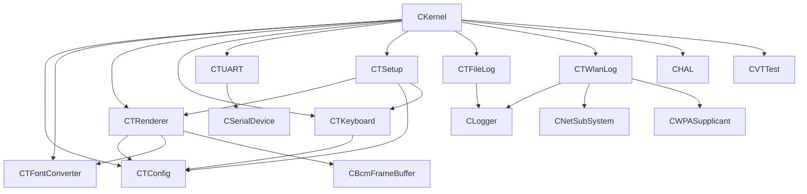
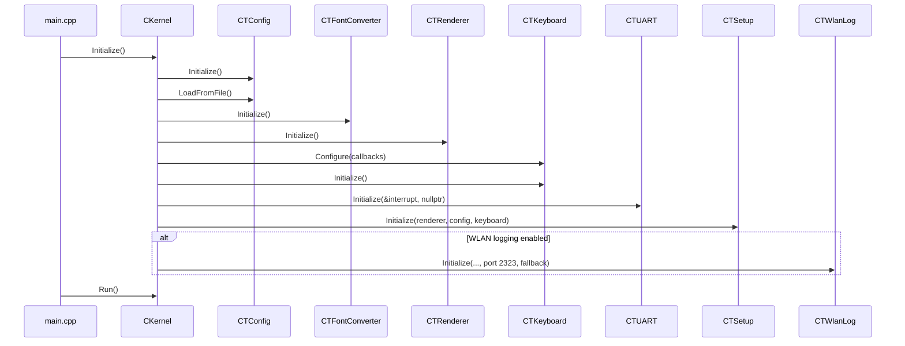
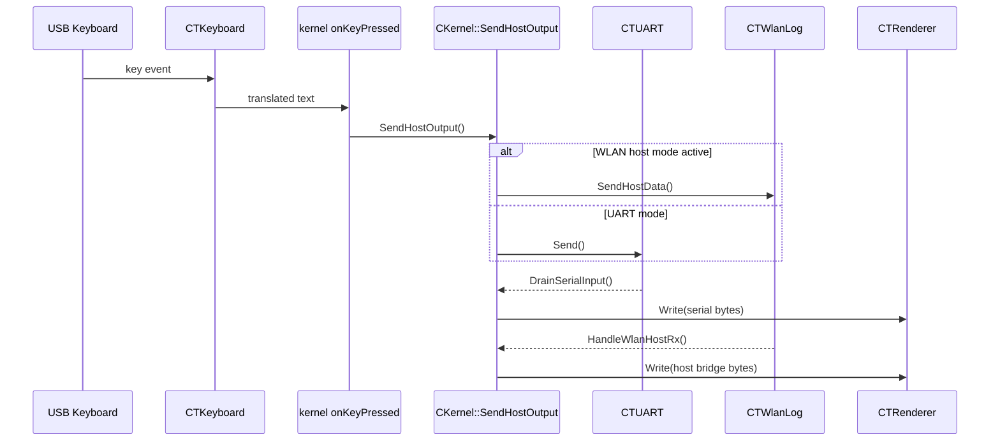

# VT100 Architecture and Technical Implementation (VT100)

This is the single technical reference for developers.
It combines architecture, dependency structure, runtime flow, and module-level implementation details that were previously spread across multiple documents.

## Table of Contents

- 1. Document role
- 2. Runtime module map (current)
- 3. Dependency graph (implementation-aligned)
- 4. Boot and initialization sequence
- 5. Task model and interaction pattern
- 6. Runtime data flows
  - 6.1 Keyboard to host flow
  - 6.2 Host to display flow
- 7. Setup subsystem details
  - 7.1 Legacy setup (F12)
  - 7.2 Modern setup (F11)
  - 7.3 Setup key handling specifics
  - 7.4 Local mode (F10)
- 8. Logging and network integration
  - 8.1 Sink selection model
  - 8.2 File sink
  - 8.3 WLAN/telnet sink
    - 8.3.1 WLAN session model (strict separation)
    - 8.3.2 Data-path gates by session
    - 8.3.3 Telnet negotiation policy by session
    - 8.3.4 Connect/close lifecycle and allowed command surface
  - 8.4 Kernel networking loop and lifecycle
- 9. Font and rendering details
  - 9.1 DEC special graphics and charset switching
- 10. HAL and buzzer details
- 11. Configuration persistence contract
- 12. Development notes

## 1. Document role

Project documentation model:

1. `README.md` — functional/user view
2. `docs/VT100_Architecture.md` (this file) — technical architecture + implementation details
3. `docs/Configuration_Guide.md` — configuration reference (user + admin/developer)
4. `docs/Hardware.md` — carrier board and backplate hardware documentation

## 2. Runtime module map (current)

Primary modules in `VT100/src`:

- `kernel.cpp` (`CKernel`) — system bring-up, task orchestration, host routing
- `TConfig.cpp` (`CTConfig`) — defaults, parser, validation, persistence (`SD:/VT100.txt`)
- `TRenderer.cpp` (`CTRenderer`) — framebuffer terminal rendering and cursor/attribute handling
- `TFontConverter.cpp` + `VT100_FontConverter.cpp` — VT100 font conversion and lookup
- `TKeyboard.cpp` (`CTKeyboard`) — USB keyboard processing, repeat, line-ending conversion
- `TUART.cpp` (`CTUART`) — serial init and polling read/write abstraction
- `TSetup.cpp` (`CTSetup`) — legacy setup + modern setup dialog
- `TFileLog.cpp` (`CTFileLog`) — SD log sink with fallback
- `TWlanLog.cpp` (`CTWlanLog`) — telnet/log sink + host bridge mode
- `hal.cpp` (`CHAL`) — buzzer PWM and GPIO16 TX/RX switching
- `VTTest.cpp` — integrated terminal test runner

## 3. Dependency graph (implementation-aligned)

Notes:

- `CKernel` remains the integration hub and lifecycle owner of singleton task modules.
- `CTConfig` is the runtime configuration source of truth.
- `CTSetup` edits runtime configuration through `CTConfig` setters and persists changes with `SaveToFile()`.

## 4. Boot and initialization sequence

`main.cpp` calls `CKernel::Initialize()` then `CKernel::Run()`.

Current initialization order in `CKernel::Initialize()`:

1. Screen and logger base services
2. Interrupt/timer/USB/HAL
3. SD/EMMC mount (`SD:`)
4. `CTConfig` initialize + load (`SD:/VT100.txt`)
5. Apply config-coupled hardware/log state
6. Font converter, renderer, keyboard, UART, setup, test modules
7. Optional WLAN log/telnet initialization
8. Start periodic task and continue to runtime loop

## 5. Task model and interaction pattern

The refactoring model captured in `docs/Refactoring_Note.md` is retained where it still matches code:

- singleton access per subsystem (`Get()`)
- explicit `Initialize()` stage before task activity
- cooperative task execution (`CTask` + scheduler yielding)
- kernel-owned callback registration for keyboard/raw-key routing

Implementation notes aligned with current code:

- `CTRenderer` uses `TASK_LEVEL` spin locking to avoid long interrupt suppression during heavy framebuffer operations.
- `CTUART` task exists but serial data path is polled by kernel via `DrainSerialInput()`.
- kernel run loop services serial, optional networking, scheduler yield, and HAL updates.

## 6. Runtime data flows

### 6.1 Keyboard to host flow

- keyboard HID event → `CTKeyboard`
- `CTKeyboard` applies line-ending mode from `CTConfig`
- kernel `onKeyPressed()` checks runtime local mode first
- when local mode is ON: keyboard text is looped directly to renderer
- when local mode is OFF: routing continues via `SendHostOutput()`
- destination:
  - WLAN host mode active: TCP client
  - else: UART TX

### 6.2 Host to display flow

- UART RX polling path: kernel `ProcessSerial()` → renderer write
- WLAN host mode RX path: `HandleWlanHostRx()` → renderer write
- setup visibility guard: serial/host rendering is suppressed while setup overlay is visible

## 7. Setup subsystem details

### 7.1 Legacy setup (F12)

- trigger: raw HID key `0x45`
- behavior: Setup A/B compatibility flow
- page transitions: header rendering normalizes ANSI/DEC attribute, charset, and width state before drawing (prevents style leakage between Setup A and Setup B)

### 7.2 Modern setup (F11)

- trigger: raw HID key `0x44` or `CTSetup::ShowModern()`
- rendering: DEC graphics frame (`ESC ( 0`), centered double-width/bold title, three-column parameter/value/description rows
- controls:
  - Up/Down select row
  - Left/Right edit value
  - Enter save + persist + exit
  - Esc cancel + exit

### 7.3 Setup key handling specifics

Handled navigation sequences in setup input path:

- `ESC [ A`, `ESC [ B`, `ESC [ C`, `ESC [ D`, `ESC [ H`, `ESC [ F`

Keyboard auto-repeat currently includes:

- printable ASCII
- newline / carriage return / backspace / delete chars
- arrows (`ESC [ A/B/C/D`)
- delete key (`ESC [ 3 ~`)

### 7.4 Local mode (F10)

- trigger: raw HID key `0x43`
- runtime action: toggles `CKernel` local mode state
- ON behavior: keypress text is written directly to `CTRenderer`
- OFF behavior: keypress text follows standard host routing (WLAN host mode/UART)
- UX feedback: renderer prints `VT100 local mode ON/OFF` when toggled

## 8. Logging and network integration

### 8.1 Sink selection model

`CTConfig::ResolveLogOutputs()` decodes `log_output` into sink flags:

- screen
- file (`CTFileLog`)
- WLAN (`CTWlanLog`)

### 8.2 File sink

`CTFileLog`:

- writes to `SD:/<log_filename>`
- recreates file at startup
- writes header + compile stamp
- flushes by thresholds and on stop
- forwards to fallback sink

### 8.3 WLAN/telnet sink

`CTWlanLog`:

- listens on port `2323`
- uses strict per-session mode separation (log mode vs host mode) on the same endpoint
- supports mode policy via `wlan_host_autostart` (`0` off, `1` log, `2` host)
- in auto-host raw sessions, telnet option negotiation is bypassed to avoid control-byte leakage into host payload

#### 8.3.1 WLAN session model (strict separation)

Session selection is made at connect time from `wlan_host_autostart`:

- `0` => WLAN remote mode disabled
- `1` => log-mode session
- `2` => host-mode session

Operational intent by session:

- Log mode: diagnostics/control (`help`, `status`, `echo`, `exit`) with remote log mirroring and command prompt.
- Host mode: raw VT100 host bridge only (keyboard TX to host, host RX to renderer), no prompt/parser chatter in payload.

Internal runtime state follows this strict split:

- `SessionLogMode`
- `SessionHostMode`
- `SessionClosing`

#### 8.3.2 Data-path gates by session

Log mode gates:

- logger->remote mirror enabled
- host TX/RX bridge forwarding disabled
- command parser and prompt emission enabled

Host mode gates:

- logger->remote mirror disabled
- host TX/RX bridge forwarding enabled
- command parser and prompt emission suppressed

#### 8.3.3 Telnet negotiation policy by session

- Log mode: telnet option negotiation enabled.
- Host mode (raw client path): telnet option negotiation bypassed to prevent control-byte artifacts in host payload.

#### 8.3.4 Connect/close lifecycle and allowed command surface

- Connect transitions directly to log or host session according to `wlan_host_autostart`.
- `exit` command is valid only in log mode.
- Host mode remains raw for the entire TCP session and ends by TCP disconnect.
- On host disconnect, firmware returns to stable local-ready/waiting behavior without in-session mode switching.

### 8.4 Kernel networking loop and lifecycle

Current kernel behavior aligned with implementation:

- starts in waiting state when WLAN logging is enabled (`MarkTelnetWaiting()`)
- enables serial output when telnet is ready (`MarkTelnetReady()`)
- processes `m_Net.Process()` during runtime loop
- advertises mDNS endpoint once available and logs telnet command

Important correction vs older planning text:

- there is no dedicated deferred-serial backlog queue with 4 KiB cap in current implementation; serial routing is controlled by readiness/host-mode guards in the run loop.

This architecture section is now the canonical source for WLAN log/host separation design and lifecycle behavior.

## 9. Font and rendering details

Font modules:

- `src/TFontConverter.cpp` (task wrapper + API)
- `src/VT100_FontConverter.cpp` (conversion/tables)
- `include/TFontConverter.h` (`EFontSelection`)

Current relevant font selections:

- `1` `VT100Font8x20`
- `2` `VT100Font10x20`
- `3` `VT100Font10x20Solid`
- graphics variants: `6`, `8`, `10`

User-facing persisted selection currently uses `font_selection` values `1..3`.

### 9.1 DEC special graphics and charset switching

`CTRenderer` implements ISO 2022 VT100 charset switching with explicit G0/G1 state tracking:

- Character set state:
    - `m_G0CharSet`
    - `m_G1CharSet`
    - `m_bUseG1` (active locking shift)
- Parser states include designator handling for G0/G1 (`StateG0`, `StateG1`).
- Escape/control handling:
    - `ESC (` designates G0
    - `ESC )` designates G1
    - `SI` (`0x0F`) selects G0
    - `SO` (`0x0E`) selects G1
- Designators:
    - `'A'` / `'B'` → US set
    - `'0'` → DEC graphics set

Graphics rendering behavior:

- Renderer keeps a dedicated graphics char generator (`m_pGraphicsCharGen`) alongside the main generator.
- When a main font is selected, a matching graphics font is derived (`8x20`, `10x20`, `10x20Solid` variants).
- During `DisplayChar`, if the active set is graphics and input is in DEC graphics range (`0x60..0x7E`), rendering temporarily uses the graphics generator.

State persistence behavior:

- Save/restore of renderer state includes `g0CharSet`, `g1CharSet`, and `useG1` so setup overlays and state transitions preserve active charset context.

## 10. HAL and buzzer details

`CHAL` implementation (replacing legacy app-level PWM module):

- GPIO12 buzzer output
- software-timed 800 Hz PWM (`CUserTimer`)
- `BEEP()` (~250 ms), `Click()` (~25 ms)
- volume driven by `buzzer_volume`
- key-click enable via `key_click`
- GPIO16 TX/RX switch via `switch_txrx`

## 11. Configuration persistence contract

Authoritative persisted key set is defined by `CTConfig::SaveToFile()`.

Persisted domains include serial framing, cursor/display mode, font/color, buzzer/keyboard behavior, repeat tuning, wiring switch, WLAN host-mode flag, and logging configuration.

Current persisted set also includes `smooth_scroll` (0/1), which controls renderer-side non-blocking smooth animation for single-line scroll operations.

Current persisted set also includes:

- `wrap_around` (0/1) for right-margin wrap behavior
- `margin_bell` (0/1) for bell at right-margin minus 8 columns

Setup B mapping note:

- Group 1, leftmost bit (mask `0x8`, VT100 “Scroll”) is wired to `smooth_scroll`.
- Group 2, leftmost bit (mask `0x8`, VT100 “Bell”) is wired to `margin_bell`.
- Group 3, second bit from left (mask `0x4`, VT100 “Wraparound”) is wired to `wrap_around`.

For value semantics and user/admin guidance see `docs/Configuration_Guide.md`.

## 12. Development notes

- QEMU-specific runtime/build fallback paths were intentionally removed from `VT100`.
- Current implementation enforces strict separation of log-mode command sessions and host-mode raw sessions on `:2323`, selected per connection via `wlan_host_autostart`.
- For configuration changes, keep `CTConfig` defaults/parser/setters/save format and `Configuration_Guide.md` in sync.
- `docs/Refactoring_Note.md` remains useful as historical refactoring context, but this file is the normative technical reference.

Renderer behavior note (current implementation):

- Smooth scrolling is implemented for single-line scroll paths (`Scroll`, `InsertLines(1)`, `DeleteLines(1)`) with a tick-driven, non-blocking animation in the renderer update loop.
- Reverse index (RI) scrolling triggers at the top of the active scroll region.
