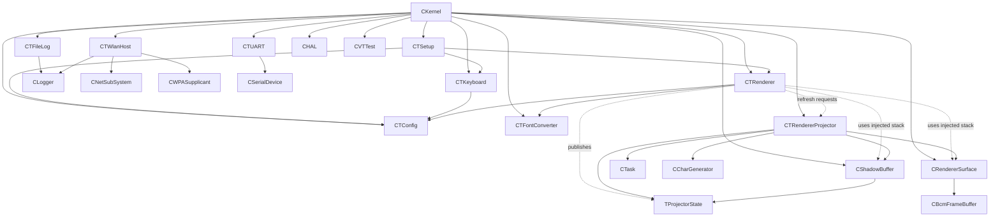
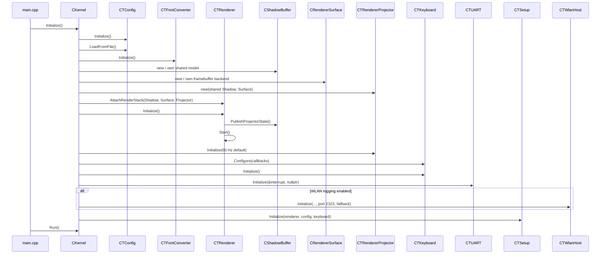
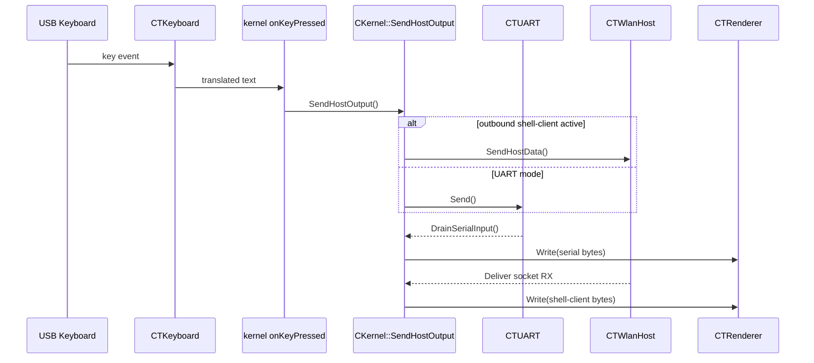
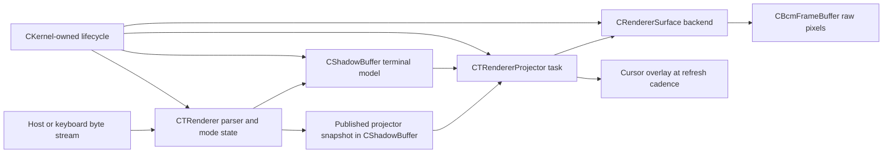

# VT100 Architecture and Technical Implementation (VT100)

This is the single technical reference for developers.
It combines architecture, dependency structure, runtime flow, and module-level implementation details that were previously spread across multiple documents.

## Table of Contents

- 1. Document role
- 2. Runtime module map (current)
- 3. Dependency graph (implementation-aligned)
- 4. Boot and initialization sequence
- 5. Task model and interaction pattern
- 6. Runtime data flows
  - 6.1 Keyboard to host flow
  - 6.2 Host to display flow
- 7. Setup subsystem details
  - 7.1 Legacy setup (F12)
  - 7.2 Modern setup (F11)
  - 7.3 Setup key handling specifics
  - 7.4 Local mode (F10)
- 8. Logging and network integration
  - 8.1 Sink selection model
  - 8.2 File sink
  - 8.3 WLAN/telnet sink
    - 8.3.1 Current-state session model (implemented)
    - 8.3.2 Current shell-client path (implemented)
    - 8.3.3 Routing gates (implemented)
    - 8.3.4 Future cleanup
  - 8.4 Kernel networking loop and lifecycle
- 9. Font and rendering details
    - 9.1 Renderer pipeline split
    - 9.2 DEC special graphics and charset switching
- 10. HAL and buzzer details
- 11. Configuration persistence contract
- 12. Development notes

## 1. Document role

Project documentation model:

1. `README.md` — functional/user view
2. `docs/VT100_Architecture.md` (this file) — technical architecture + implementation details
3. `docs/Configuration_Guide.md` — configuration reference (user + admin/developer)
4. `docs/Hardware.md` — carrier board and backplate hardware documentation

## 2. Runtime module map (current)

Primary modules in `VT100/src`:

- `kernel.cpp` (`CKernel`) — system bring-up, task orchestration, host routing, and ownership of the shared renderer stack
- `TConfig.cpp` (`CTConfig`) — defaults, parser, validation, persistence (`SD:/VT100.txt`)
- `TRenderer.cpp` (`CTRenderer`) — public renderer facade, parser host, terminal-state owner, and shared projector-state publisher using a kernel-injected render stack
- `TShadowBuffer.cpp` (`CShadowBuffer`) — authoritative normal/alternate screen text, style, DEC line-size storage, and lockable projector snapshot state
- `TRendererProjector.cpp` (`CTRendererProjector`) — periodic framebuffer projection task that redraws shadow state and cursor overlay from the shared snapshot
- `TRendererSurface.cpp` (`CRendererSurface`) — framebuffer backend that owns `CBcmFrameBuffer`, raw pixel storage, color conversion, and row-oriented pixel operations
- `TFontConverter.cpp` + `VT100_FontConverter.cpp` — VT100 font conversion and lookup
- `TKeyboard.cpp` (`CTKeyboard`) — USB keyboard processing, repeat, line-ending conversion
- `TUART.cpp` (`CTUART`) — serial init and polling read/write abstraction
- `TSetup.cpp` (`CTSetup`) — legacy setup + modern setup dialog
- `TFileLog.cpp` (`CTFileLog`) — SD log sink with fallback
- `TWlanHost.cpp` (`CTWlanHost`) — telnet/log sink + outbound shell-client mode
- `hal.cpp` (`CHAL`) — buzzer PWM and GPIO16 TX/RX switching
- `VTTest.cpp` — integrated terminal test runner

## 3. Dependency graph (implementation-aligned)

```mermaid
graph TD
  CKernel --> CTConfig
  CKernel --> CTFontConverter
  CKernel --> CTRenderer
  CKernel --> CShadowBuffer
  CKernel --> CRendererSurface
  CKernel --> CTRendererProjector
  CKernel --> CTKeyboard
  CKernel --> CTUART
  CKernel --> CTSetup
  CKernel --> CTFileLog
  CKernel --> CTWlanHost
  CKernel --> CHAL
  CKernel --> CVTTest

  CTSetup --> CTRenderer
  CTSetup --> CTConfig
  CTSetup --> CTKeyboard

  CTKeyboard --> CTConfig
  CTRenderer --> CTConfig
  CTRenderer --> CTFontConverter
  CTRenderer -. uses injected stack .-> CShadowBuffer
  CTRenderer -. uses injected stack .-> CRendererSurface
  CTRenderer -. refresh requests .-> CTRendererProjector
  CTRenderer -. publishes .-> TProjectorState
  CTRendererProjector --> CShadowBuffer
  CTRendererProjector --> TProjectorState
  CTRendererProjector --> CRendererSurface
  CTRendererProjector --> CTask

  CTFileLog --> CLogger
  CTWlanHost --> CLogger
  CTWlanHost --> CNetSubSystem
  CTWlanHost --> CWPASupplicant

  CTUART --> CSerialDevice
  CRendererSurface --> CBcmFrameBuffer
  CTRendererProjector --> CCharGenerator
  CShadowBuffer --> TProjectorState
```

Notes:

- `CKernel` remains the integration hub and lifecycle owner of singleton task modules.
- `CKernel` now owns `CShadowBuffer`, `CRendererSurface`, and `CTRendererProjector` and injects them into `CTRenderer` before renderer initialization.
- `CTConfig` is the runtime configuration source of truth.
- `CTSetup` edits runtime configuration through `CTConfig` setters and persists changes with `SaveToFile()`.
- `CTRenderer` no longer owns `CShadowBuffer`, `CTRendererProjector`, or `CRendererSurface`; it uses the kernel-owned render stack through `AttachRenderStack()` and exposes only the terminal-facing facade to the rest of the system.
- `CTRendererProjector` no longer reads framebuffer-facing state from `CTRenderer`; it consumes only `CShadowBuffer` snapshot data plus `CRendererSurface`.

## 4. Boot and initialization sequence

`main.cpp` calls `CKernel::Initialize()` then `CKernel::Run()`.

Current initialization order in `CKernel::Initialize()`:

1. Screen and logger base services
2. Interrupt/timer/USB/HAL
3. SD/EMMC mount (`SD:`)
4. `CTConfig` initialize + load (`SD:/VT100.txt`)
5. Apply config-coupled hardware/log state
6. Font converter, renderer, keyboard, UART, setup, test modules
7. Optional WLAN log/telnet initialization
8. Start periodic task and continue to runtime loop

```mermaid
sequenceDiagram
  participant Main as main.cpp
  participant Kernel as CKernel
  participant Config as CTConfig
  participant Font as CTFontConverter
  participant Renderer as CTRenderer
  participant Shadow as CShadowBuffer
  participant Surface as CRendererSurface
  participant Projector as CTRendererProjector
  participant Keyboard as CTKeyboard
  participant UART as CTUART
  participant Setup as CTSetup
  participant Wlan as CTWlanHost

  Main->>Kernel: Initialize()
  Kernel->>Config: Initialize()
  Kernel->>Config: LoadFromFile()
  Kernel->>Font: Initialize()
  Kernel->>Shadow: new / own shared model
  Kernel->>Surface: new / own framebuffer backend
  Kernel->>Projector: new(shared Shadow, Surface)
  Kernel->>Renderer: AttachRenderStack(Shadow, Surface, Projector)
  Kernel->>Renderer: Initialize()
  Renderer->>Shadow: PublishProjectorState()
  Renderer->>Renderer: Start()
  Kernel->>Projector: Initialize(60 Hz default)
  Kernel->>Keyboard: Configure(callbacks)
  Kernel->>Keyboard: Initialize()
  Kernel->>UART: Initialize(&interrupt, nullptr)
  alt WLAN logging enabled
    Kernel->>Wlan: Initialize(..., port 2323, fallback)
  end
  Kernel->>Setup: Initialize(renderer, config, keyboard)
  Main->>Kernel: Run()
```

## 5. Task model and interaction pattern

The refactoring model captured in `docs/Refactoring_Note.md` is retained where it still matches code:

- singleton access per subsystem (`Get()`)
- explicit `Initialize()` stage before task activity
- cooperative task execution (`CTask` + scheduler yielding)
- kernel-owned callback registration for keyboard/raw-key routing

Implementation notes aligned with current code:

- `CTRenderer` uses `TASK_LEVEL` spin locking while mutating parser/runtime state, and `CShadowBuffer` exposes its own `TASK_LEVEL` spin lock for projector snapshot access.
- `CTRendererProjector` runs as its own cooperative `CTask` and refreshes the framebuffer at a fixed cadence instead of repainting synchronously inside renderer call sites.
- `CTUART` task exists but serial data path is polled by kernel via `DrainSerialInput()`.
- kernel run loop services serial, optional networking, scheduler yield, and HAL updates.

## 6. Runtime data flows

### 6.1 Keyboard to host flow

- keyboard HID event → `CTKeyboard`
- `CTKeyboard` applies line-ending mode from `CTConfig`
- kernel `onKeyPressed()` checks runtime local mode first
- when local mode is ON: keyboard text is looped directly to renderer
- when local mode is OFF: routing continues via `SendHostOutput()`
- destination:
  - outbound shell-client session active: remote TCP peer
  - else: UART TX

### 6.2 Host to display flow

- UART RX polling path: kernel `ProcessSerial()` → renderer write
- outbound shell-client RX path: WLAN socket receive → renderer write
- setup visibility guard: serial/host rendering is suppressed while setup overlay is visible

```mermaid
sequenceDiagram
  participant HID as USB Keyboard
  participant Kbd as CTKeyboard
  participant Kcb as kernel onKeyPressed
  participant Router as CKernel::SendHostOutput
  participant Uart as CTUART
  participant Wlan as CTWlanHost
  participant Rndr as CTRenderer

  HID->>Kbd: key event
  Kbd->>Kcb: translated text
  Kcb->>Router: SendHostOutput()
  alt outbound shell-client active
    Router->>Wlan: SendHostData()
  else UART mode
    Router->>Uart: Send()
  end

  Uart-->>Router: DrainSerialInput()
  Router->>Rndr: Write(serial bytes)

  Wlan-->>Router: Deliver socket RX
  Router->>Rndr: Write(shell-client bytes)
```

## 7. Setup subsystem details

### 7.1 Legacy setup (F12)

- trigger: raw HID key `0x45`
- behavior: Setup A/B compatibility flow
- page transitions: header rendering normalizes ANSI/DEC attribute, charset, and width state before drawing (prevents style leakage between Setup A and Setup B)
- overlay restore: dialog entry saves the full `CTRenderer` state including shadow cells and DEC line attributes, and dialog exit restores from that saved renderer/shadow snapshot instead of replaying a separate raw-framebuffer backup

### 7.2 Modern setup (F11)

- trigger: raw HID key `0x44` or `CTSetup::ShowModern()`
- rendering: DEC graphics frame (`ESC ( 0`), centered normal-width title, three-column parameter/value/description rows
- overlay model: dialog drawing goes through normal `CTRenderer::ClearDisplay()`, `Goto()`, and `Write()` paths so setup content is written into the authoritative shadow model and then projected to the framebuffer by `CTRendererProjector`
- execution model: cooked and raw key callbacks only queue the latest pending dialog input; `CTSetup::Run()` consumes that pending input and performs all dialog redraws in task context so renderer writes stay valid while shell-client and WLAN tasks are active
- controls:
  - Up/Down select row
  - Left/Right edit value
  - Enter save + persist + exit
  - Esc cancel + exit

### 7.3 Setup key handling specifics

Handled navigation sequences in setup input path:

- `ESC [ A`, `ESC [ B`, `ESC [ C`, `ESC [ D`, `ESC [ H`, `ESC [ F`

Visibility and routing rules:

- while `CTSetup::IsVisible()` is true, cooked and raw keyboard input are forwarded to `CTSetup` before VTTest, local-mode, UART, or shell-client host routing
- shell-client and UART RX are dropped while the dialog is visible so the overlay remains stable until restore

Keyboard auto-repeat currently includes:

- printable ASCII
- newline / carriage return / backspace / delete chars
- arrows (`ESC [ A/B/C/D`)
- delete key (`ESC [ 3 ~`)

### 7.4 Local mode (F10)

- trigger: raw HID key `0x43`
- runtime action: toggles `CKernel` local mode state
- ON behavior: keypress text is written directly to `CTRenderer`
- OFF behavior: keypress text follows standard host routing (outbound shell-client when active, otherwise UART)
- UX feedback: renderer prints `VT100 local mode ON/OFF` when toggled

## 8. Logging and network integration

### 8.1 Sink selection model

`CTConfig::ResolveLogOutputs()` decodes `log_output` into sink flags:

- screen
- file (`CTFileLog`)
- WLAN (`CTWlanHost`)

### 8.2 File sink

`CTFileLog`:

- writes to `SD:/<log_filename>`
- recreates file at startup
- writes header + compile stamp
- flushes by thresholds and on stop
- forwards to fallback sink

### 8.3 WLAN/telnet sink

`CTWlanHost`:

- exposes the incoming telnet/log endpoint on port `2323`
- keeps log-mode command handling (`help`, `status`, `echo`, `exit`) separate from outbound shell-client payload routing
- supports runtime mode policy via `wlan_host_autostart` (`0` off, `1` log, `2` outbound shell-client)
- reuses `host_id` as the persisted default shell-client target and otherwise prompts locally for `IPv4[:port]`

#### 8.3.1 Current-state session model (implemented)

Session selection is made from `wlan_host_autostart`:

- `0` => WLAN remote mode disabled
- `1` => incoming telnet stays in log-mode session
- `2` => outbound shell-client path is activated

Operational intent by session:

- Log mode: diagnostics/control (`help`, `status`, `echo`, `exit`) with remote log mirroring and command prompt.
- Shell-client mode: VT100 initiates a raw TCP session to a configured remote peer; keyboard TX is bridged uplink and socket RX is rendered directly, with no log/prompt chatter in the payload.

Current implementation details that matter operationally:

- incoming telnet remains the logging/command surface
- `host_id` can auto-start the outbound shell-client connection without local prompting
- if `host_id` is empty, VT100 prompts on screen for `IPv4[:port]`
- hostnames are not accepted on that shell-client input path; numeric IPv4 plus optional port is required

#### 8.3.2 Current shell-client path (implemented)

The current shell-client path works as follows:

- `DisplayPromptIfReady()` prepares local target capture after WLAN bring-up.
- If `host_id` is valid, connection setup starts immediately without interactive prompt entry.
- Otherwise the renderer shows `Shell Client mode selected` and requests `IPv4[:port]`.
- During an active shell-client session, UART host rendering is suppressed to avoid mixed host sources.
- Renderer writes from the remote socket are chunked to keep the terminal responsive during bursty output.

#### 8.3.3 Routing gates (implemented)

Log-mode gates:

- logger->remote mirroring enabled when WLAN logging is part of `log_output`
- prompt/command parser enabled for the incoming telnet session
- shell-client payload routing disabled

Shell-client gates:

- keyboard uplink redirected to the outbound TCP socket
- socket downlink enabled to renderer
- UART host rendering suppressed while the shell-client session is active
- no log-mode prompt or command parser chatter is inserted into the raw shell-client payload

#### 8.3.4 Future cleanup

The remaining cleanup is mostly terminology and configuration-surface simplification:

1. Decide whether `wlan_host_autostart` should remain public or be replaced by a clearer explicit `wlan_mode_policy` key.
2. Decide whether `host_id` should stay as a single `IPv4[:port]` string or be split into explicit host/port keys.
3. Keep `README.md`, `Configuration_Guide.md`, and `tools/README.md` synchronized as the shell-client UX evolves.

### 8.4 Kernel networking loop and lifecycle

Current kernel behavior aligned with implementation:

- starts in waiting state when WLAN logging is enabled (`MarkTelnetWaiting()`)
- enables serial output when telnet is ready (`MarkTelnetReady()`)
- processes `m_Net.Process()` during runtime loop
- advertises mDNS endpoint once available and logs telnet command

Important correction vs older planning text:

- there is no dedicated deferred-serial backlog queue with 4 KiB cap in current implementation; serial routing is controlled by readiness/host-mode guards in the run loop.

This architecture section is now the canonical source for WLAN log/shell-client separation design and lifecycle behavior.

## 9. Font and rendering details

Font modules:

- `src/TFontConverter.cpp` (task wrapper + API)
- `src/VT100_FontConverter.cpp` (conversion/tables)
- `include/TFontConverter.h` (`EFontSelection`)

Current relevant font selections:

- `1` `VT100Font8x20`
- `2` `VT100Font10x20`
- `3` `VT100Font10x20Solid`
- graphics variants: `6`, `8`, `10`

User-facing persisted selection currently uses `font_selection` values `1..3`.

Current renderer architecture is shadow-buffer-first:

- text cells, attributes, and DEC line-size state are maintained in shadow storage as the authoritative terminal model
- terminal mutations such as character writes, erase operations, insert/delete character or line operations, and state restore update shadow state first
- the framebuffer is treated as a projection target behind the kernel-owned `CRendererSurface`, which is refreshed by the kernel-owned periodic projector task from shadow state plus the published render snapshot
- setup save/restore and shadow-based rerender paths rely on this separation so visible pixels can be rebuilt from terminal state instead of serving as the primary source of truth

### 9.1 Renderer pipeline split

The renderer pipeline is currently divided into five cooperating parts:

- `CKernel` owns the shared renderer stack lifetime, wires the dependencies, and starts the projector task during system initialization.
- `CTRenderer` owns parser state, terminal modes, color/font policy, and the public terminal-facing API; it publishes projector-visible state into the shared model but does not own framebuffer backends or projector lifetime.
- `CShadowBuffer` owns the authoritative terminal model for both the normal and alternate screens, including per-cell style snapshots, per-row DEC line-size attributes, and the lockable projector snapshot consumed by the render task.
- `CRendererSurface` owns the framebuffer device, raw pixel buffer, raw/logical color conversion, and row-oriented pixel mutations.
- `CTRendererProjector` runs as a periodic task, is owned and started by `CKernel`, consumes only `CShadowBuffer` plus `CRendererSurface`, and redraws the full visible framebuffer whenever the shared snapshot generation or blink state changes.

The practical consequence is that terminal mutations no longer paint pixels directly as the primary state transition. Instead they follow a model-first path, mark the shared projector snapshot dirty, and let the periodic projector task rebuild the framebuffer from that state.

```mermaid
flowchart LR
  Kernel[CKernel-owned lifecycle] --> Parser[CTRenderer parser and mode state]
  Kernel --> Shadow[CShadowBuffer terminal model]
  Kernel --> Projector[CTRendererProjector task]
  Kernel --> Surface[CRendererSurface backend]
  Input[Host or keyboard byte stream] --> Parser
  Parser --> Shadow[CShadowBuffer terminal model]
  Parser --> Snapshot[Published projector snapshot in CShadowBuffer]
  Shadow --> Projector
  Snapshot --> Projector
  Projector --> Surface
  Surface --> Framebuffer[CBcmFrameBuffer raw pixels]
  Projector --> Cursor[Cursor overlay at refresh cadence]
```

Implementation-aligned responsibilities:

- character writes, erase operations, insert/delete character or line operations, scroll-region mutations, and setup state restore update shadow state first
- `CTRenderer` publishes cursor, geometry, font-generator, color, and blink-policy data into `CShadowBuffer::TProjectorState`
- `CKernel` creates the shared render stack, injects it into `CTRenderer`, and starts `CTRendererProjector` as an independent task during `Initialize()`
- `CTRendererProjector` refreshes the framebuffer from `CShadowBuffer` on its own task cadence and uses the shared snapshot for cursor/blink timing and glyph selection
- `CRendererSurface` centralizes raw pixel writes, row fills, row scrolls, incremental flushes, and color translation so projector logic no longer depends on `CBcmFrameBuffer` ownership in `CTRenderer`
- cursor display remains a framebuffer projection concern, but it is now rendered as part of the projector task instead of synchronous pixel inversion in renderer code paths
- legacy renderer facade methods such as `RenderShadowRow()` or `InvertCursor()` now effectively request a projector refresh instead of performing immediate framebuffer work

This keeps the public renderer interface narrower while preserving the same behavior at existing call sites and makes the framebuffer update cadence explicit and independent from VT100 parser execution.

### 9.2 DEC special graphics and charset switching

`CTRenderer` implements ISO 2022 VT100 charset switching with explicit G0/G1 state tracking:

- Character set state:
    - `m_G0CharSet`
    - `m_G1CharSet`
    - `m_bUseG1` (active locking shift)
- Parser states include designator handling for G0/G1 (`StateG0`, `StateG1`).
- Escape/control handling:
    - `ESC (` designates G0
    - `ESC )` designates G1
    - `SI` (`0x0F`) selects G0
    - `SO` (`0x0E`) selects G1
- Designators:
    - `'A'` / `'B'` → US set
    - `'0'` → DEC graphics set

Graphics rendering behavior:

- Renderer keeps a dedicated graphics char generator (`m_pGraphicsCharGen`) alongside the main generator.
- When a main font is selected, a matching graphics font is derived (`8x20`, `10x20`, `10x20Solid` variants).
- During `DisplayChar`, if the active set is graphics and input is in DEC graphics range (`0x60..0x7E`), rendering temporarily uses the graphics generator.

State persistence behavior:

- Save/restore of renderer state includes `g0CharSet`, `g1CharSet`, and `useG1` so setup overlays and state transitions preserve active charset context.

## 10. HAL and buzzer details

`CHAL` implementation (replacing legacy app-level PWM module):

- GPIO12 buzzer output
- software-timed 800 Hz PWM (`CUserTimer`)
- `BEEP()` (~250 ms), `Click()` (~25 ms)
- volume driven by `buzzer_volume`
- key-click enable via `key_click`
- GPIO16 TX/RX switch via `switch_txrx`

## 11. Configuration persistence contract

Authoritative persisted key set is defined by `CTConfig::SaveToFile()`.

Persisted domains include serial framing, cursor/display mode, font/color, buzzer/keyboard behavior, repeat tuning, wiring switch, WLAN mode/target settings, and logging configuration.

Current persisted set also includes `smooth_scroll` (0/1), which controls renderer-side non-blocking smooth animation for single-line scroll operations.

Current persisted set also includes:

- `smooth_scroll_ms` (10..500) for the target duration per scrolled text line
- `wrap_around` (0/1) for right-margin wrap behavior
- `margin_bell` (0/1) for bell at right-margin minus 8 columns
- `host_id` (`IPv4[:port]`) for the default outbound shell-client target

Runtime clamping note:

- `buzzer_volume` is constrained to `0..80`
- `smooth_scroll_ms` is constrained to `10..500`
- `repeat_delay_ms` is constrained to `250..1000`
- `repeat_rate_cps` is constrained to `2..20`
- `serial_bits` is constrained to `7` or `8`

Setup B mapping note:

- Group 1, leftmost bit (mask `0x8`, VT100 “Scroll”) is wired to `smooth_scroll`.
- Group 2, leftmost bit (mask `0x8`, VT100 “Bell”) is wired to `margin_bell`.
- Group 3, second bit from left (mask `0x4`, VT100 “Wraparound”) is wired to `wrap_around`.

For value semantics and user/admin guidance see `docs/Configuration_Guide.md`.

## 12. Development notes

- QEMU-specific runtime/build fallback paths were intentionally removed from `VT100`.
- Current implementation enforces strict separation of incoming log-mode command sessions and outbound shell-client raw sessions, coordinated through `wlan_host_autostart` and `host_id`.
- For configuration changes, keep `CTConfig` defaults/parser/setters/save format and `Configuration_Guide.md` in sync.
- `docs/Refactoring_Note.md` remains useful as historical refactoring context, but this file is the normative technical reference.

Renderer behavior note (current implementation):

- Smooth scrolling is implemented for single-line scroll paths (`Scroll`, `InsertLines(1)`, `DeleteLines(1)`) with a tick-driven, non-blocking animation in the renderer update loop.
- Reverse index (RI) scrolling triggers at the top of the active scroll region.
